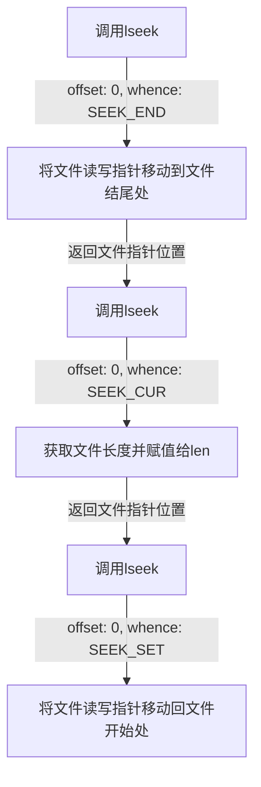
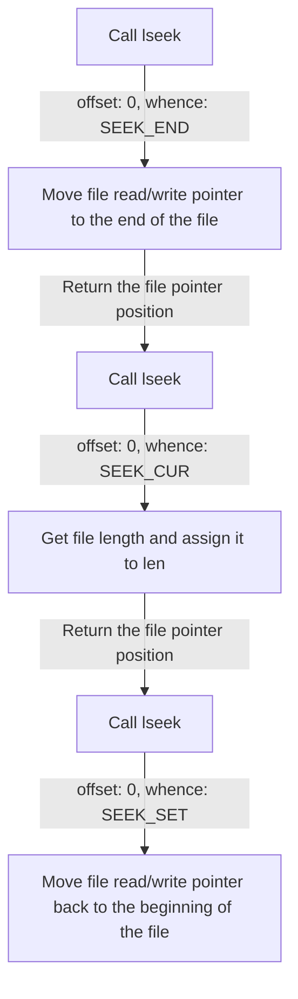

# 第六章小笔记


## 使用文件读写指针获取文件长度

我们会用到`lseek`系统调用, 来移动文件读写指针. 

``` shell
       man lseek # 在shell中使用该命令获取函数的信息, 如下
       
       #include <sys/types.h>
       #include <unistd.h>
       off_t lseek(int fd, off_t offset, int whence);
```

具体的操作流程如下

1. 调用`lseek`并将其的第二个参数`offset`和第三个参数`whence`分别设置为__0__与__SEEK_END__, 将文件读写指针移动到文件的结尾处
2. 同上, 第二次调用`lseek`, 只是`whence`设置为__SEEK_CUR__; 并将计算返回的偏移量赋值给`len`(实际在这里目的已经达成, 即获取到了文件的长度)
3. 第三次调用`lseek`, 把`whence`设置为__SEEK_SET__, 将读写指针移动回文件开始处




实例:

``` c
int len;
	/*获取文件长度并保持文件读写指针在文件开始处*/
	if (lseek(fd, 0, SEEK_END) == -1) {
		my_err("lseek", __LINE__);
		/* __LINE__ 是一个预定义宏，表示当前代码所在的行号，用于获取错误发生的位置 */
	}
	if ((len = lseek(fd, 0, SEEK_CUR)) == -1) { // 前一个lseek调用已经将读写指针指向文件末尾
		my_err("lseek", __LINE__);
	}
	if ((lseek(fd, 0, SEEK_SET)) == -1) { // 指向文件开头
		my_err("lseek", __LINE__);
	}
	
```

---

English Edition

## Getting File Length Using File Read/Write Pointer

We will use the `lseek` system call to move the file read/write pointer.

```shell
       man lseek # Use this command in the shell to get information about the function, as follows
       
       #include <sys/types.h>
       #include <unistd.h>
       off_t lseek(int fd, off_t offset, int whence);
```

The specific operation process is as follows:

1. Call `lseek` and set its second parameter `offset` and third parameter `whence` to 0 and `SEEK_END`, respectively, to move the file read/write pointer to the end of the file.
2. Call `lseek` again with the same parameters as above, except for setting `whence` to `SEEK_CUR`. Assign the calculated offset returned by the function to `len` (the purpose of this step is to obtain the length of the file).
3. Call `lseek` again and set `whence` to `SEEK_SET` to move the read/write pointer back to the beginning of the file.




Here is an example:

```c
int len;
/* Get the length of the file and keep the file read/write pointer at the beginning of the file */
if (lseek(fd, 0, SEEK_END) == -1) {
    my_err("lseek", __LINE__);
    /* __LINE__ is a predefined macro that represents the current line number of the code, used to obtain the location where the error occurred */
}
if ((len = lseek(fd, 0, SEEK_CUR)) == -1) { // The previous lseek call has already moved the read/write pointer to the end of the file.
    my_err("lseek", __LINE__);
}
if ((lseek(fd, 0, SEEK_SET)) == -1) { // Move the read/write pointer to the beginning of the file.
    my_err("lseek", __LINE__);
}
```

---

