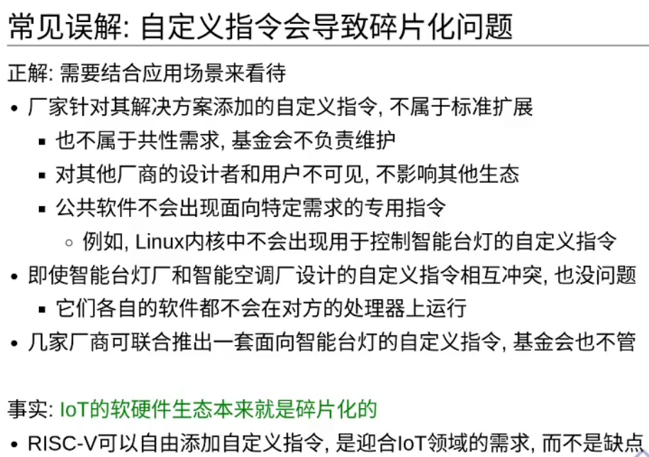

## RISC-V syscall

exit is syscall 93

write is syscall 64

* 精简指令集

* 扩展

* 模块化

如果软件需要使用拓展的指令，RISC-V硬件会在软件中___捕获___并执行需要的功能，作为标准库的一部分。

* 定制化

* 板子拿给你，根据自己的使用场景可以随心所欲地添加自定义指令。

用似定长的变长指令集。

* 大多数时候是4字节定长指令
* 通过模块化拓展支持变长指令（同时实现隔离）

### 什么是架构和具体实现的分离？？？

简单来说就是将系统架构的各部分分离开单独进行开发。可以看看Linux的不同子系统。

