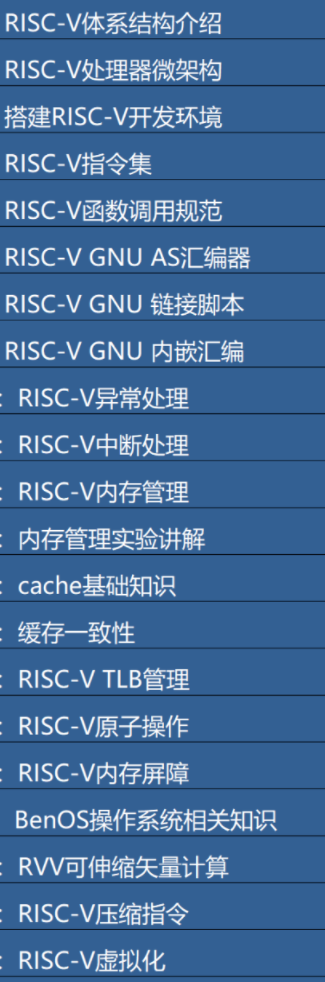

# 自学risc-v系统结构

前提条件：要求有基本计算机组成原理，计算机系统结构基础。

阅读《计算机组成与设计（RISC-V版）》第一、二章，可以在整体结构上对 RISC-V 体系建立基本认知。再进行后面的学习比较有效果。

#### 自学材料和练习要求:

1. 阅读书籍和在线课程

   - 自学[PPT for RISC-V特权指令级架构](https://content.riscv.org/wp-content/uploads/2018/05/riscv-privileged-BCN.v7-2.pdf)
   - 自学[RISC-V手册：一本开源指令集的指南](http://riscvbook.com/chinese/RISC-V-Reader-Chinese-v2p1.pdf) 重点是第10章
   - （Option）自学[RIS-V特权指令级规范](https://riscv.org/technical/specifications/) 重点是与OS相关的特权硬件访问的规范内容（Privileged Spec）
   - （Option）自学[RISC-V汇编手册](https://github.com/riscv-non-isa/riscv-asm-manual/blob/master/riscv-asm.md)
   - （Option）[计算机组成与设计：RISC-V 教材](https://item.jd.com/12887758.html) 这是完整的课程教材，不要求全部看完，请根据自己的需求选择。
   - （Option）[计算机组成与设计：RISC-V 浙大在线课程](http://www.icourse163.org/course/ZJU-1452997167) 这是完整的一门课，不要求全部看完，请根据自己的需求选择。

2. 其他参考学习信息

   - （Option）[Berkeley CS61C: Great Ideas in Computer Architecture (Machine Structures)](http://www-inst.eecs.berkeley.edu/~cs61c/sp18/)

   > Option的含义是：如果有足够的时间建议看看，否则在后续要用到时或需要查询进一步信息时再查阅这些内容。

   