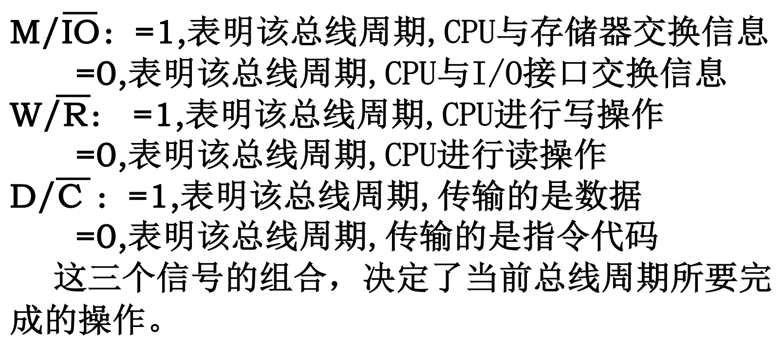
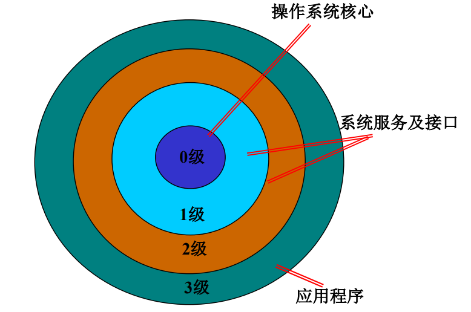
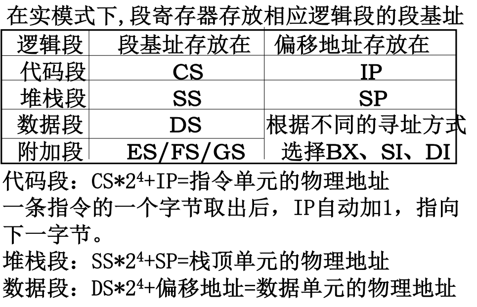
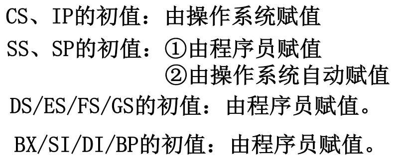

## 总线周期

cpu通过总线与存储器、i/o交换一个数据所需要的时间



---

## 32位微处理器的工作模式

* 实模式
* 保护模式
* 虚拟8086模式

### 实模式与保护模式

逻辑地址（虚拟地址或编程地址）到物理地址的转换只__分段__就是实模式；

> 线性地址: 逻辑地址经过分段转化就是线性地址。 


而保护模式先__分段__,再__分页__。

如上图，在实模式下线性地址就是物理地址，保护模式下还需要对线性地址进行分页得到物理地址。

#### 特点

实模式下段寄存器存放___段基址___

保护模式下段寄存器存放___段选择符___

保护模式下支持多任务操作系统

### 虚拟8086模式

该模式是__保护模式__下的一种特殊工作模式，可运行实模式程序。

486可以分时运行多个实模式程序，因为在此模式下486认为段寄存器存放的是__段基址__而非段选择符。

---

## 保护机制

系统定义4个特权级




---





---

## 启动

电源打开时，先加电自检（POST)，后寻找启动盘，发现以0xAA55结束说明是引导扇区，BIOS将这512字节的引导扇区内容转载到内存地址0000:7c00并在此转交控制权给引导代码，到此计算机变成由操作系统的一部分控制。

### movx

```  asm
movx source, destination
```

movx其中 x 可以是下面的字符：

* l用于32位的长字值

* w用于16位的字值

* b用于8位的字节值

  实例：

```asm
movl   %eax, %ebx #把32位的EAX寄存器值传送给32位的EBX寄存器值
movw   %ax, %bx   #把16位的EAX寄存器值传送给16位的EBX寄存器值
movb   %al, %lx   #把8位的EAX寄存器值传送给8位的EBX寄存器值
```


### andl

假定以下值存储在指示的存储器地址和寄存器中：


现在，我们有一条指令：

``` asm
addl  %ecx, (%eax)
```

EAX包含0x100; 0x100中的值为0xFF; ECX包含0x1。

0x1 + 0xFF = 0x100。 

然后将最终结果放入EAX指向的地址。 因此，(0X100) == 0x100

### 解析

ESP point to the bottom 

value of EAX == -8192

EAX == -8192 + value of ESP


