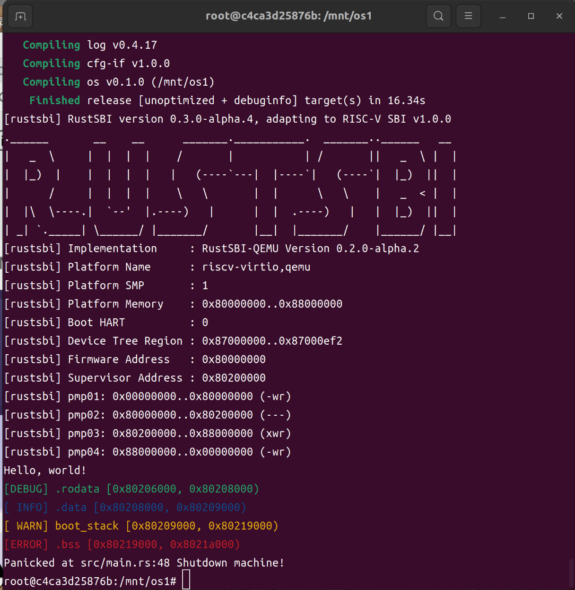
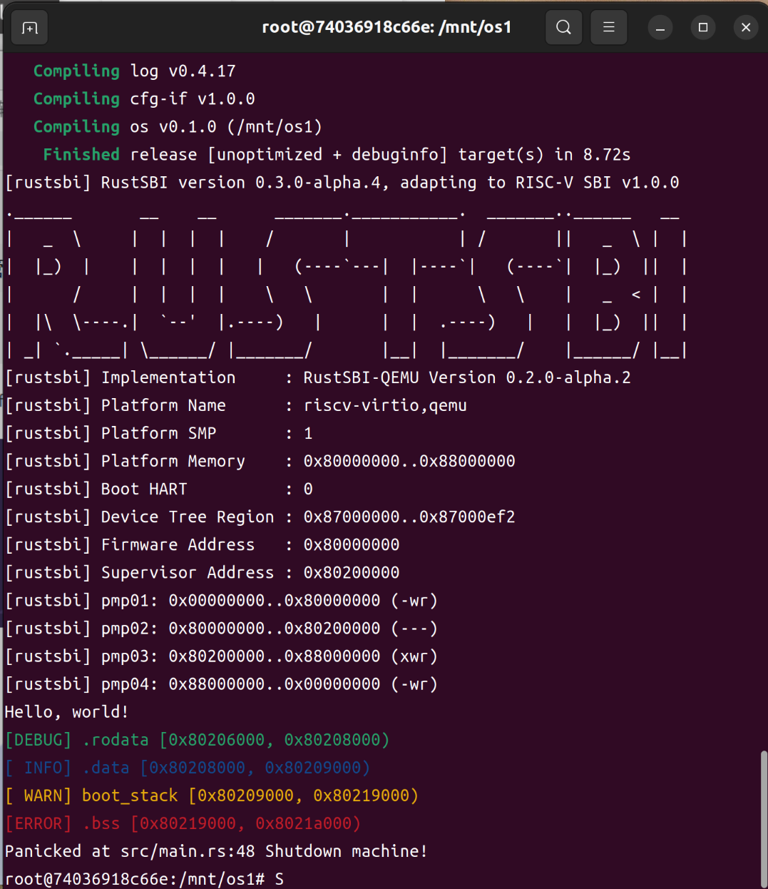

# LearningOS by Rust

## 小白第一步——配置实验环境（Ubuntu22.04以Docker方式搭建）
1. 下载`Docker`或`Docker Desktop`(后者有图像化界面，对初学者更友好~~大概~~)

2. 换源换源换源！

   * 这里`Docker`可以参考[简书](https://www.jianshu.com/p/90a11a836978)和[Docker容器网速很慢](https://blog.csdn.net/weixin_40894428/article/details/85206883?spm=1001.2101.3001.6650.6&utm_medium=distribute.pc_relevant.none-task-blog-2%7Edefault%7ECTRLIST%7ERate-6-85206883-blog-51779368.pc_relevant_3mothn_strategy_recovery&depth_1-utm_source=distribute.pc_relevant.none-task-blog-2%7Edefault%7ECTRLIST%7ERate-6-85206883-blog-51779368.pc_relevant_3mothn_strategy_recovery&utm_relevant_index=8),完成后重启Docker服务

     > sudo service docker restart 

   * `Docker Desktop`可以参考[Docker Desktop切换中国镜像源](https://blog.csdn.net/Yvesty/article/details/118601701)

3. 按照[官方教程手册](https://learningos.github.io/rust-based-os-comp2022/0setup-devel-env.html)配置

### 结果

Ubuntu 22.04 `Docker`

 

Ubuntu22.04 `Docker Desktop`

### 心得体会

* 认真读官方教程不然会浪费大量时间
* 需要了解一些Linux,Git和Docker的基本命令
* To the moon!