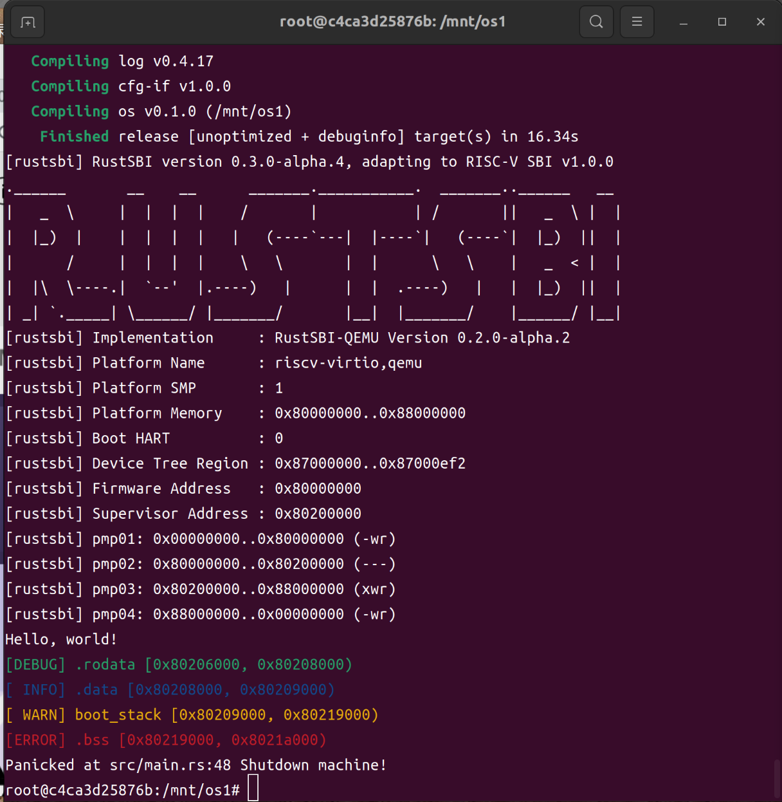
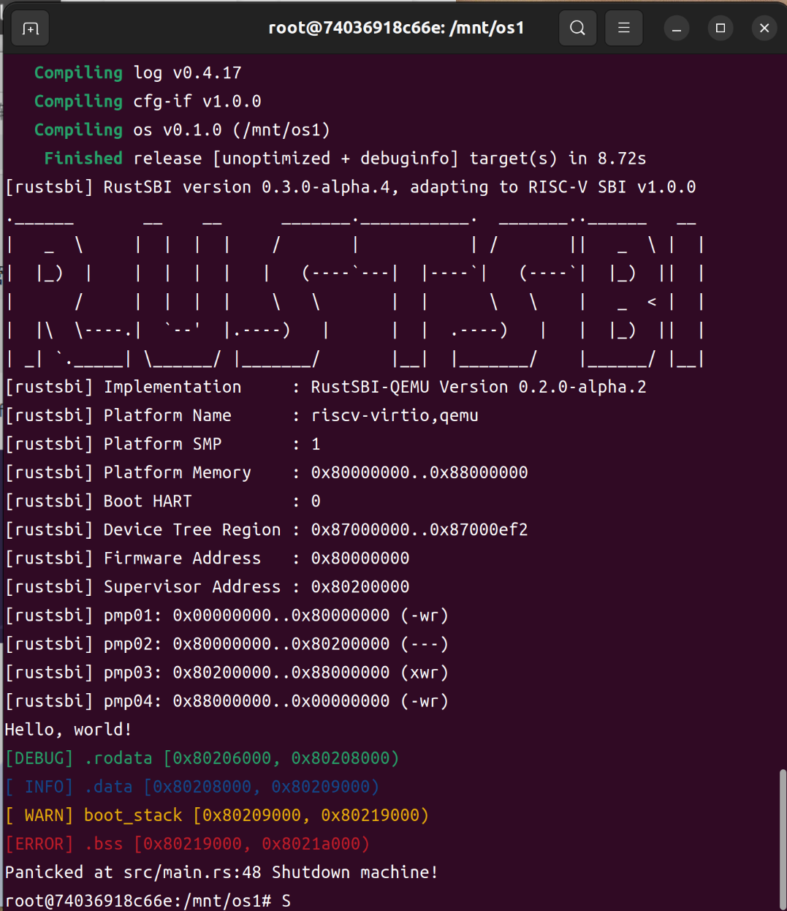

# 代码
```c
#! /usr/bin/env/bpftrace
#include <linux/socket.h>
#include <net/sock.h>
#include <linux/tcp.h>
#include <linux/skbuff.h>
#include <linux/ip.h>
#include <net/protocol.h>
#include <linux/types.h>

//网络层是为了验证临时加的
kprobe: ip_rcv
/ comm == "clash-linux" /
{
    $skb = (struct sk_buff *)arg0;
    printf("ip_rcv: %s %x sklen:%x\n", comm, 
    (struct iphdr *)($skb->head + $skb->transport_header),
    $skb->len);
}

kprobe: ip_local_deliver
/ comm == "clash-linux" /
{
    $skb = (struct sk_buff *)arg0;
    printf("ip_local_deliver: %s %x sklen:%x\n", comm, 
    (struct iphdr *)($skb->head + $skb->transport_header),
    $skb->len);
}

kprobe: ip_local_deliver_finish
/ comm == "clash-linux" /
{
    $skb = (struct sk_buff *)arg2;
    printf("ip_local_deliver_finish: %s %x sklen:%x\n", comm, 
    (struct iphdr *)($skb->data),
    $skb->len);
}

kprobe: tcp_v4_rcv
/ comm == "clash-linux" /
{
    $skb = (struct sk_buff *)arg0;
    /*
     *th = tcp_hdr(skb)
     *tcp_hdr结构定义如下：
     *static inline struct tcphdr *tcp_hdr(const struct sk_buff *skb)
     *  {
	 *      return (struct tcphdr *)skb_transport_header(skb);
     *  }
     *而skb_transport_header的定义又为：
     *static inline unsigned char *skb_transport_header(const struct sk_buff *skb) 
     *  {
	 *      DEBUG_NET_WARN_ON_ONCE(!skb_transport_header_was_set(skb));
	 *      return skb->head + skb->transport_header;
     *  }
     *  因为是内联函数，无法跟踪。直接定义其返回结果
     */
    $skb_transport_header = $skb->head + $skb->transport_header;
    $th = (struct tcphdr *)$skb_transport_header;//@th = (struct tcphdr *)$skb->data;
    //同理可得
    $iph = (struct iphdr *)($skb->head + $skb->network_header);
    @dir = ntop(AF_INET,$iph->daddr);
    printf("tcp_v4_rcv: %-18s %x %s len:%x, sklen:%x\n", comm, $th, @dir, $th->doff, $skb->len);
    
}

kprobe: tcp_rcv_established
/ comm == "clash-linux" /
{
    $skb = (struct sk_buff *)arg1;
    $th = (struct tcphdr *)$skb->data;
    printf("tcp_rcv_established: %-18s %x len:%x, sklen:%x\n", comm, $th, $th->doff, $skb->len);
}

kprobe: tcp_queue_rcv
/ comm == "clash-linux" /
{
    $skb = (struct sk_buff *)arg1;
    printf("tcp_queue_rcv: %-18s  sklen:%x\n", comm, $skb->len);
}

kprobe: tcp_recvmsg
/ comm == "clash-linux" /
{
    printf("tcp_recvmsg: %-18s %x\n", comm, arg2);
}
```

# 结果


# 总结

* 成功~~大概~~跟踪科学上网工具
* 在skb的长度上看到了传递过程的变化。

* 哈希的部分，缺乏数据结构的知识。

* 坑满多的，看的资料和实践平台内核版本的不同，有不少的更改。
* 以后阅读源码的话会主要使用[bootin](https://elixir.bootlin.com/linux/latest/source)
  * 函数、结构等方便检索跳转
  * 可以在不同内核版本间切换

---

这周不务正业的部分

没有报名，兴趣，熟悉了以后再参加

目的是学习rust，并学习内核与更底层的相关知识（修炼内功）

# LearningOS by Rust

## 小白第一步——配置实验环境（Ubuntu22.04以Docker方式搭建）

1. 下载`Docker`或`Docker Desktop`(后者有图像化界面，对初学者更友好~~大概~~)

2. 换源换源换源！

   * 这里`Docker`可以参考[简书](https://www.jianshu.com/p/90a11a836978)和[Docker容器网速很慢](https://blog.csdn.net/weixin_40894428/article/details/85206883?spm=1001.2101.3001.6650.6&utm_medium=distribute.pc_relevant.none-task-blog-2%7Edefault%7ECTRLIST%7ERate-6-85206883-blog-51779368.pc_relevant_3mothn_strategy_recovery&depth_1-utm_source=distribute.pc_relevant.none-task-blog-2%7Edefault%7ECTRLIST%7ERate-6-85206883-blog-51779368.pc_relevant_3mothn_strategy_recovery&utm_relevant_index=8),完成后重启Docker服务

     > sudo service docker restart 

   * `Docker Desktop`可以参考[Docker Desktop切换中国镜像源](https://blog.csdn.net/Yvesty/article/details/118601701)

3. 按照[官方教程手册](https://learningos.github.io/rust-based-os-comp2022/0setup-devel-env.html)配置

### 结果

Ubuntu 22.04 `Docker`

 

Ubuntu22.04 `Docker Desktop`



### 心得体会

* 认真读官方教程不然会浪费大量时间
* 需要了解一些Linux,Git和Docker的基本命令
* To the moon!