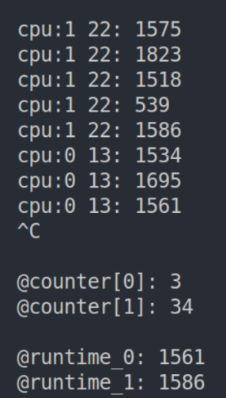

# `struct net_device`——内核链路层与上层网络协议栈的接口


向上层协议栈传送包`net_device`中`net_rx` 将`skb` 上递给`dev.c`中`netif_rx`，通过独立接口接口完成传递过程。


注意到有个`hard_start_xmit` 函数指针，当时试着打了一个观测点，追踪到了`ksoftitqd`线程，下面实例应该可以反映该线程在收发包的时间。

```c
#! /usr/bin/env/bpftrace
BEGIN{
printf("hello ksoftirqd!\n");
}

kprobe: * hard_start_xmit
{
    if(comm == "ksoftirqd/0"){ //不知道我当时为什么不用枚举....emmm没想起来;)
    @counter[0] = count();
    @get_time[0] = nsecs;
    }
    else if(comm == "ksoftirqd/1"){
    @counter[1] = count();
    @get_time[1] = nsecs;
    }
}

kretprobe: * hard_start_xmit
/@get_time[0] || @get_time[1]/ 
{
    if(comm == "ksoftirqd/0"){
        @runtime_0 = nsecs - @get_time[0];
        printf("cpu:%d %d: %d\n", cpu, tid, @runtime_0);
        clear(@get_time);
    }
    else if(comm == "ksoftirqd/1"){
        @runtime_1 = nsecs - @get_time[1];
        printf("cpu:%d %d: %d\n", cpu, tid, @runtime_1);
        clear(@get_time);
    }
}

```


