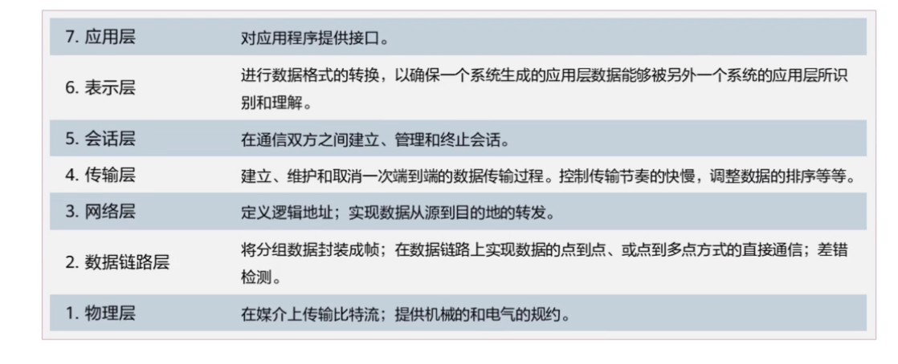
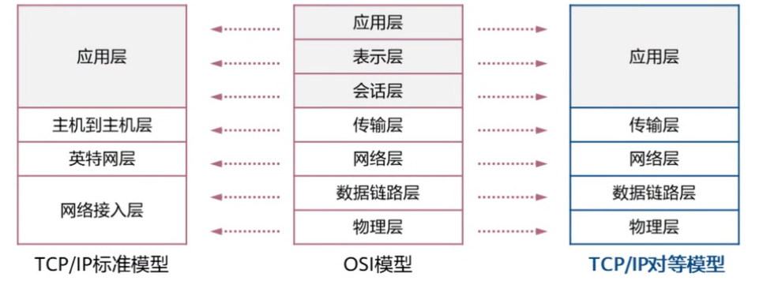
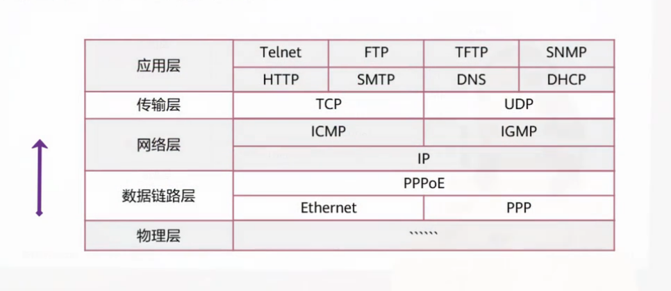
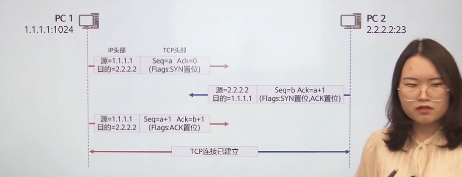
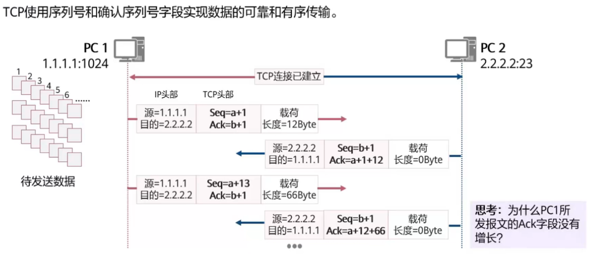

应用：为***满足人们的不同需求*** 而出现的事物，伴随其会有信息产生。

数据：信息的载体。

数据传输：在不同设备间传递数据。

数据传输模型：

* OSI参考模型（由底向上）

为什么网络层有了地址，链路层还要有地址？

> 电脑有不同的应用，区分应用也需要端口。

---

* TCP/IP模型

组织

`IETF`, `IEEE`, `ISO`

应用层：

PDU(Protocol Data Unit): Data

FTP 简单传输文件的协议

Telnet 远程登陆服务的协议

HTTP 提供发布接收HTML页面的方法的协议

---

传输层：

PDU: Segment(段)

UDP: 没有建立连接的过程，快速但确定是可能出错

TCP/UDP报文

源端口号：一般为为系统中未使用的，且大于1023

TCP建立连接 三次握手（3wh）

`tcp`字节流协议之所以可靠的原因

* 每个字节皆有编号

* 累计正应答(如果把完整数据流看作一本书，分节段落看作书的某一页，回答某页，表示已经收到某页之前的所有内容)，如图ack和seq

> 答：因为PC2回复的长度为0， ack

* 未应答重发(超时重传)

IP

端口号范围：0-65535