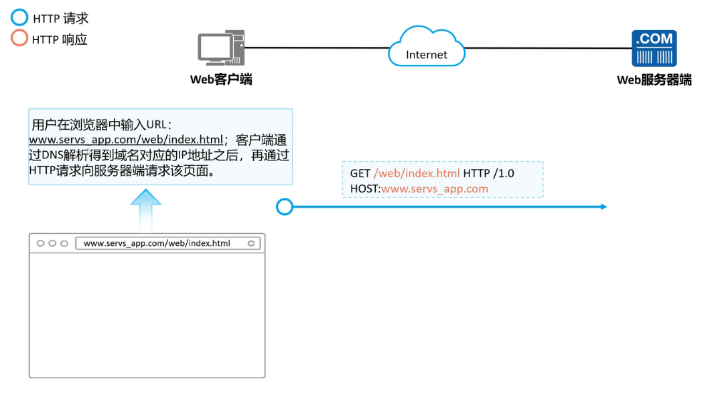
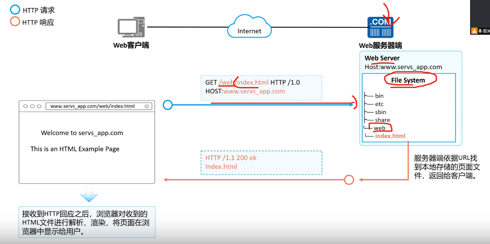
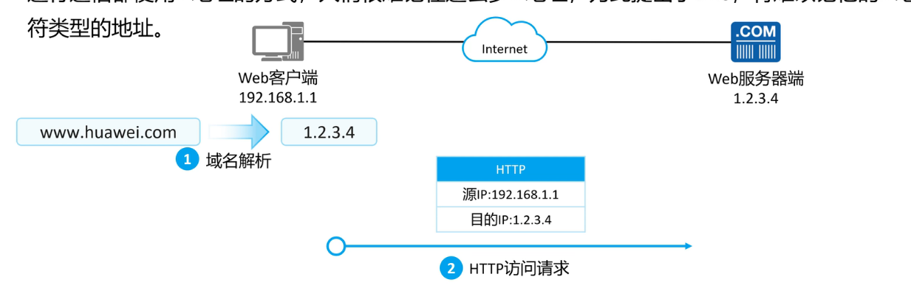
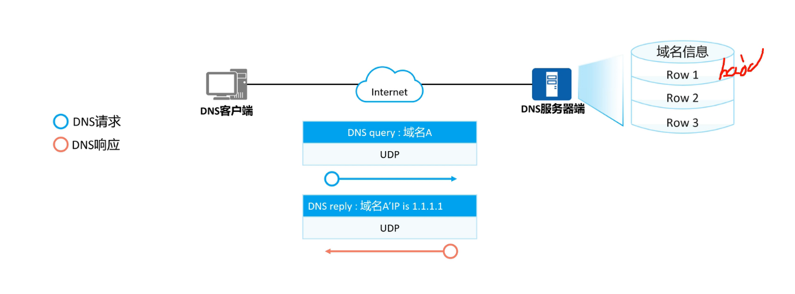
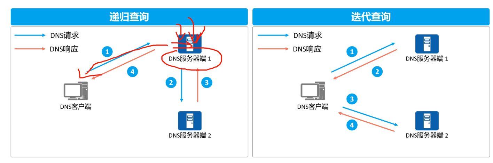
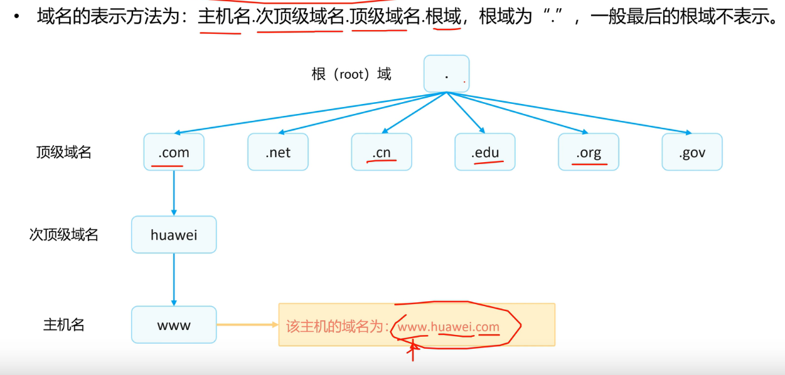

HTTP（超文本协议） web界面

是C/S架构应用，使用TCP传输

网址的专用学名为URL（统一资源定位符）

HTTP用于传输web文档，URL表明了web文档的位置

实例

域名， 通过DNS解析得对应IP端口地址

> www.XXX.com

DNS(Domain Name System)  域名解析系统

使用UDP协议传输

DNS服务器 保存维护域名与IP端口地址的对应关系

因为DNS是分布式系统

DNS查询方式

* 递归查询(超出内容，服务器帮客户端找)

* 迭代查询(超出内容，服务器告诉客户端地址，让客户端自己找)

域名表示(了解)

