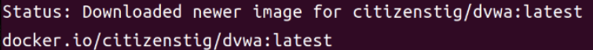
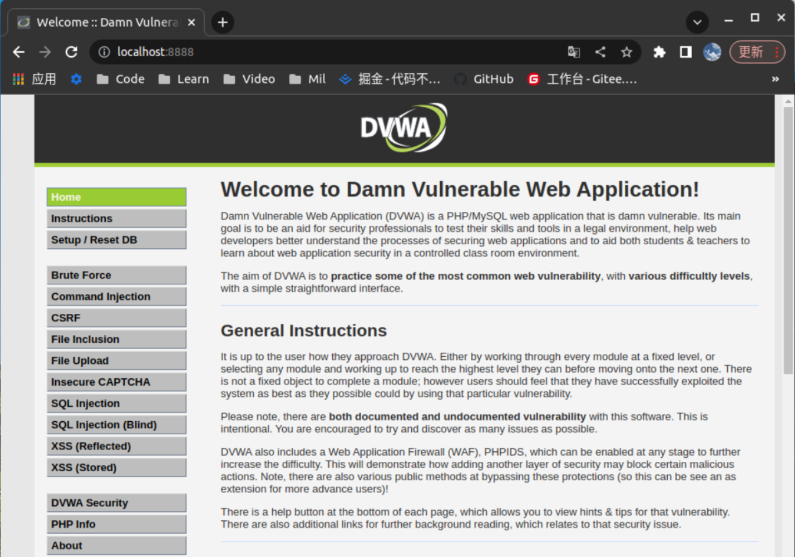

# BCC

以前在使用BCC的时候会有错误，原因应该是LLVM的版本选择冲突

这里在编译时设置动态版本的LLVM链接应该可以解决

> cmake .. -DENABLE_LLVM_SHARED=1

# 靶场

Linux环境下基于Docker的DVWA靶场搭建

```
# docker的安装
sudo apt-get install -y docker docker-compose

# docker启动、停止、重启
sudo systemctl start/stop/restart docker

# 配置docker加速器
sudo vim /etc/docker/daemon.json

{
"registry-mirrors":[
"https://dockerhub.azk8s.cn",
"https://reg-mirror.qiniu.com",
"https://1rqfztnd.mirror.aliyuncs.com"
	]
}

sudo systemctl daemon-reload
sudo systemctl restart docker

# DVWA的安装
sudo docker search dvwa
sudo docker pull *** 	#此处填写你指定的文件以拉取安装
sudo docker run --rm --name dvwa -it -p 8888:80 citizenstig/dvwa #docker运行dvwa
netstat -ntulp |grep 8888 # 查看容器指定的端口是否被打开
本地访问localhost:8888

/* default account
 * 账号:admin
 * 密码:password
 */
```




Aha! ^o^👍



记得调整靶场安全等级


