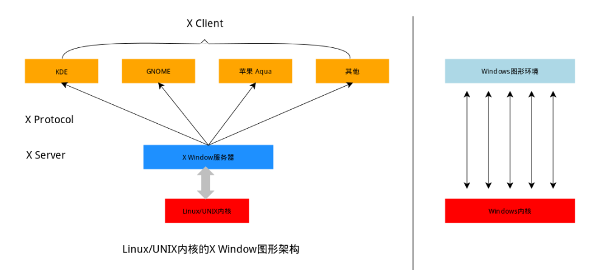

## 如何理解Linux的桌面系统

不同于Windows，Linux/Unix的图像界面实质是一套软件，如今Linux使用的是xorg，其是通过基于X架构协议规划的X窗口系统实现的。我们可以将xorg理解为提供图形界面服务的服务器，而桌面环境则是客户端。

也可以将桌面环境称为“图像Shell”或“虚拟Shell”。




## 终端的概念

Shell称为命令解释器，作为使用者和系统的中间程序。而在图形界面下为方便用户输入并显示输出，Linux提供Terminal终端模拟器程序。

终端本质上是对应着 Linux 上的/dev/tty设备，Linux的多用户登录就是通过不同的/dev/tty设备完成的，Linux默认提供了6个纯命令行界面的“terminal”（准确的说这里应该是6个virtual consoles）来让用户登录。

物理机上我们可以在命令行界面通过`[Ctrl]`+`[Alt]`+`[F1]～[F6]`进行切换，切换完成后`[Ctrl]`+`[Alt]`+`[F7]`回到图形界面。

UNIX/Linux 操作系统下的 Shell 既是用户交互的界面，也是控制系统的脚本语言。比较流行的常见的 Shell 有 bash、zsh、ksh、csh 等，Ubuntu 终端默认使用的是 bash，默认的桌面环境是 GNOME 或者 Unity（基于 GNOME）。

## 命令行

### 一些常用快捷键

| 按键            | 作用                                         |
| --------------- | -------------------------------------------- |
| `Ctrl+d`        | 键盘输入结束或退出终端                       |
| `Ctrl+s`        | 暂停当前程序，暂停后按下任意键恢复运行       |
| `Ctrl+z`        | 将当前程序放到后台运行，恢复到前台为命令`fg` |
| `Ctrl+a`        | 将光标移至输入行头，相当于`Home`键           |
| `Ctrl+e`        | 将光标移至输入行末，相当于`End`键            |
| `Ctrl+k`        | 删除从光标所在位置到行末                     |
| `Alt+Backspace` | 向前删除一个单词                             |
| `Shift+PgUp`    | 将终端显示向上滚动                           |
| `Shift+PgDn`    | 将终端显示向下滚动                           |
| `touch`|创建文件|

在创建文件的时候，如果需要一次性创建多个文件，比如：**“love_1_linux.txt，love_2_linux.txt，... love_10_linux.txt”**。在 Linux 中十分方便：

```bash
touch love_{1..10}_shiyanlou.txt
```

__通配符__实际上就是一种 Shell 实现的路径扩展功能。

### Shell 常用通配符：

| 字符                    | 含义                                       |
| ----------------------- | ------------------------------------------ |
| `*`                     | 匹配 0 或多个字符                          |
| `?`                     | 匹配任意一个字符                           |
| `[list]`                | 匹配 list 中的任意单一字符                 |
| `[^list]`               | 匹配 除 list 中的任意单一字符以外的字符    |
| `[c1-c2]`               | 匹配 c1-c2 中的任意单一字符 如：[0-9][a-z] |
| `{string1,string2,...}` | 匹配 string1 或 string2 (或更多)其一字符串 |
| `{c1..c2}`              | 匹配 c1-c2 中全部字符 如{1..10}            |

### man手册

man手册通常被分为 8 个区段，安排如下：

| 区段 | 说明                                      |
| ---- | ----------------------------------------- |
| 1    | 一般命令                                  |
| 2    | 系统调用                                  |
| 3    | 库函数，涵盖了 C 标准函数库               |
| 4    | 特殊文件（通常是/dev 中的设备）和驱动程序 |
| 5    | 文件格式和约定                            |
| 6    | 游戏和屏保                                |
| 7    | 杂项                                      |
| 8    | 系统管理命令和守护进程                    |

显示结果一般包括以下部分内容：

**NAME（名称）**

> 该命令或函数的名称，接着是一行简介。

**SYNOPSIS（概要）**

> 对于命令，正式的描述它如何运行，以及需要什么样的命令行参数。对于函数，介绍函数所需的参数，以及哪个头文件包含该函数的定义。

**DESCRIPTION（说明）**

> 命令或函数功能的文本描述。

**EXAMPLES（示例）**

> 常用的一些示例。

**SEE ALSO（参见）**

> 相关命令或函数的列表。