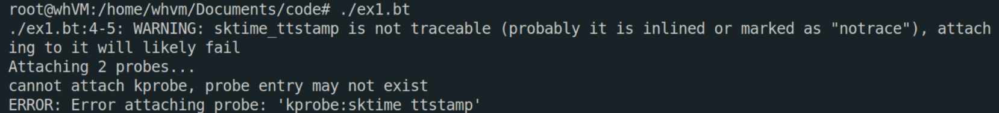
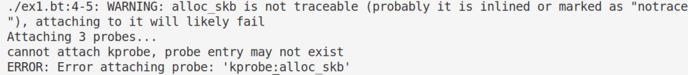
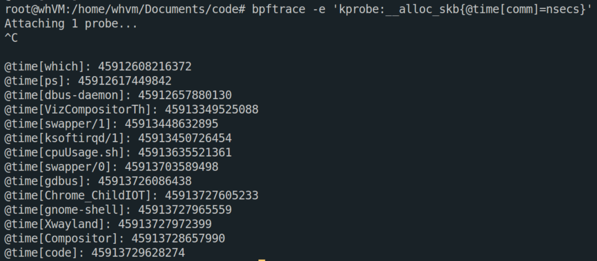
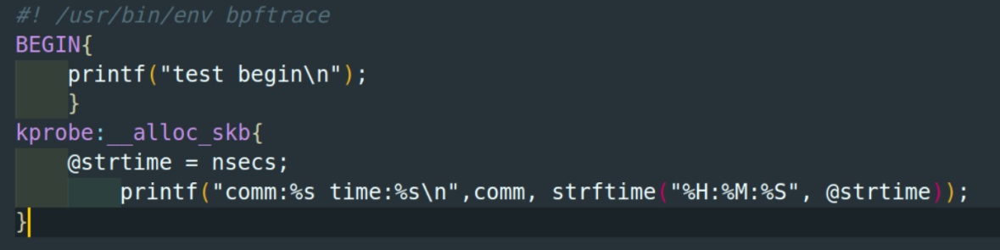
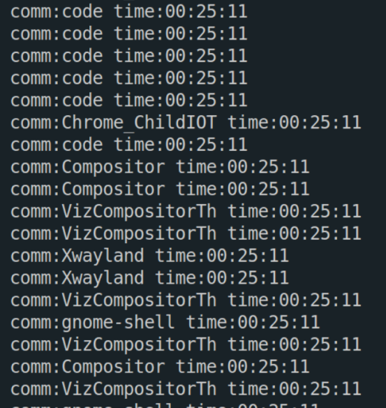
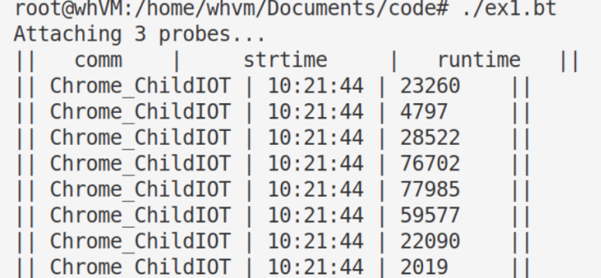
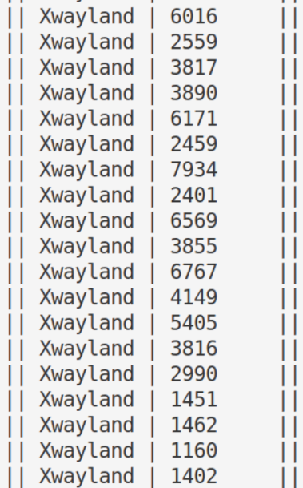
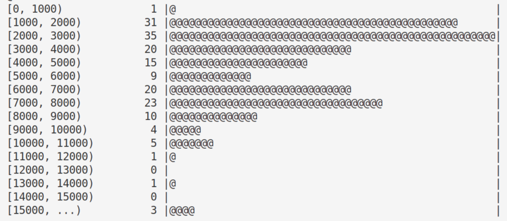

# 尝试打 Socket Buffer 的函数

## 尝试`sktime_t tstamp`和`alloc_skb`





无结果，发现不能打上头文件的函数

## 打`__alloc_skb`(与`alloc_skb`的区别在与其在.c文件中)

1. 尝试能否打上点



2. 尝试采用bpf程序的形式





3. 尝试中获取`Chrome_ChildIOT`进程的数据



4. 尝试`Xwayland`进程，得到其运行时间

```c
#! /usr/bin/env bpftrace
BEGIN{
    printf("||   comm    |   runtime   ||\n");
    }
kprobe:__alloc_skb{
    if(comm == "Xwayland"){
        @strtime = nsecs;
        
    }
}

kretprobe:__alloc_skb
/@strtime/ 
{
    if(comm == "Xwayland"){
        @runtime = nsecs - @strtime;
        printf("|| %s | %-8d ||\n", comm, @runtime);
        @hist = lhist(@runtime, 0, 15000, 1000);
        clear(@strtime);
    }
}


```

结果






# 额外的知识点

经常碰到`__u8` ,`__u32`这些

`u8`,`u32`是什么 

>  都是C的数据类型；其中u8是unsigned char，u16是unsigned short，u32是unsigned long。

`__u8`和`u8`等的区别

**本质**上一样，只是`__un`是`linux`系统的特殊定义(其早于C99标准)，无可移植性[^1]。


[^1]: https://stackoverflow.com/questions/16232557/difference-between-u8-and-uint8-t