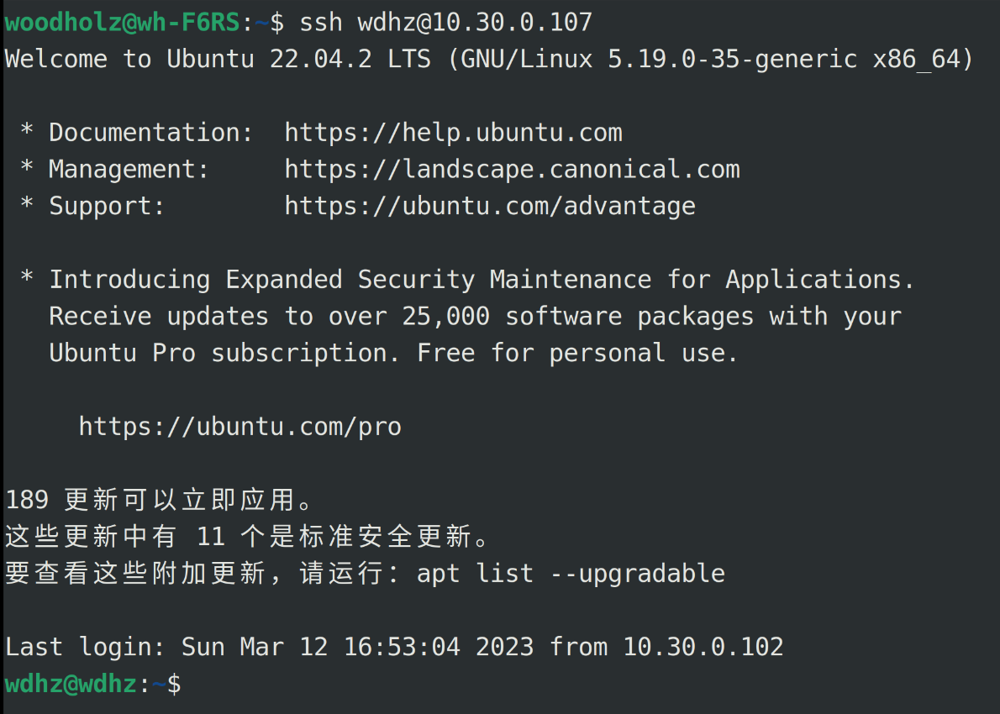
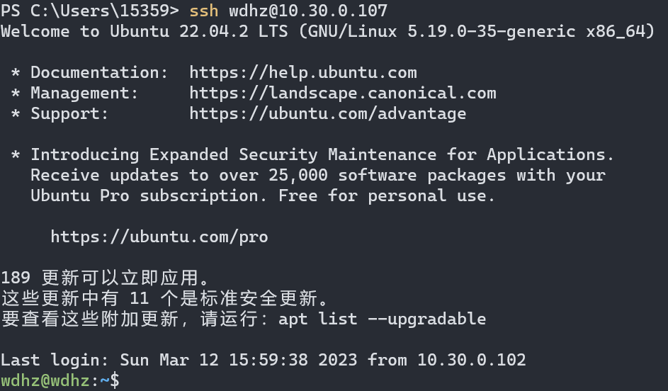
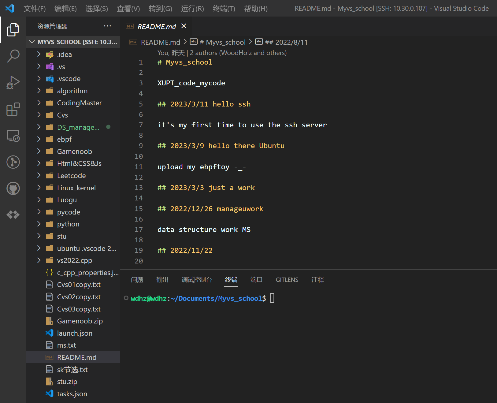

# 本周做的一些工作

1. 搜集查找有关比赛的参考资料、培训视频
2. 确定还是宏内核的方向
3. 看了一些RISC-V的介绍
4. ~~大概~~解决了旧电脑Ubuntu shutdown重启的问题
5. 使用旧电脑搭了一个ssh远程的代码和实验平台

## RISC-V介绍

### RISC-V syscall

exit is syscall 93

write is syscall 64

* 精简指令集

* 扩展

* 模块化

如果软件需要使用拓展的指令，RISC-V硬件会在软件中___捕获___并执行需要的功能，作为标准库的一部分。

* 定制化

* 板子拿给你，根据自己的使用场景可以随心所欲地添加自定义指令。

用似定长的变长指令集。

* 大多数时候是4字节定长指令
* 通过模块化拓展支持变长指令（同时实现隔离）

#### 什么是架构和具体实现的分离？？？

简单来说就是将系统架构的各部分分离开单独进行开发。可以看看Linux的不同子系统。

## ssh远程

---

旧电脑型号：ACER Aspire V 5 - 4 7 1

系统：Ubuntu 22.04、Arch Linux双系统

---

之前的代码分散在win、ubuntu和虚拟机上，零散不方便统一管理

所以把一个旧电脑作为以后统一的代码编写主机=￣ω￣=

ubuntu

win 

vscode

熟悉了ssh，公钥密钥免登录的简单使用~~其实自己一直在使用shh的方式提交github的代码只是从来没注意~~