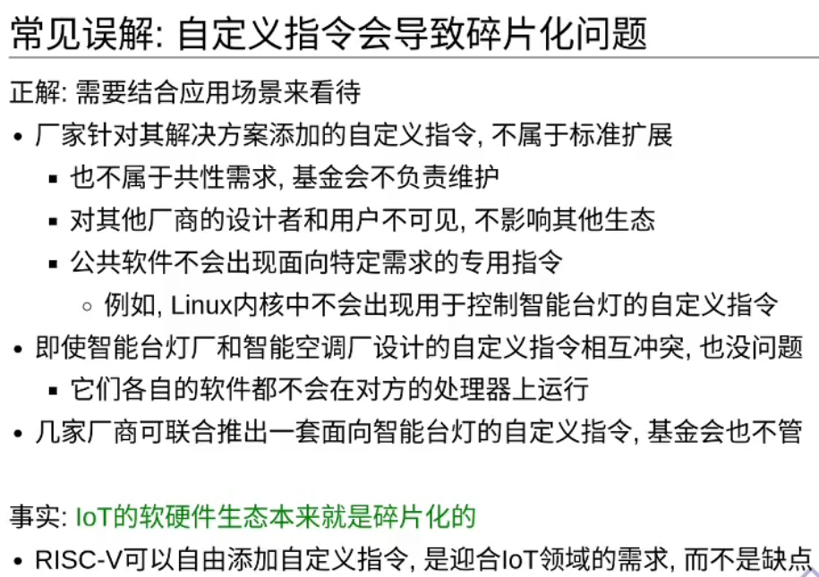
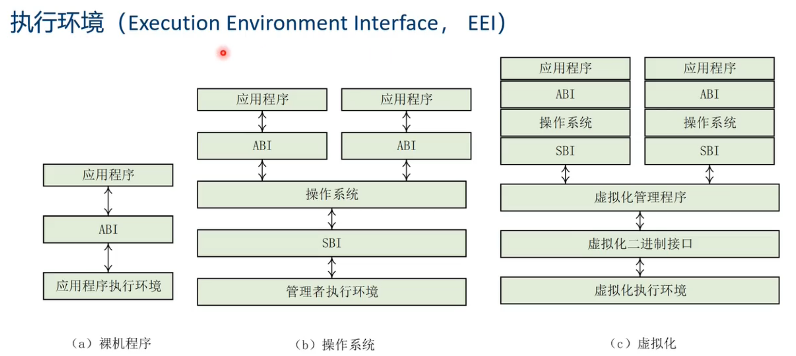
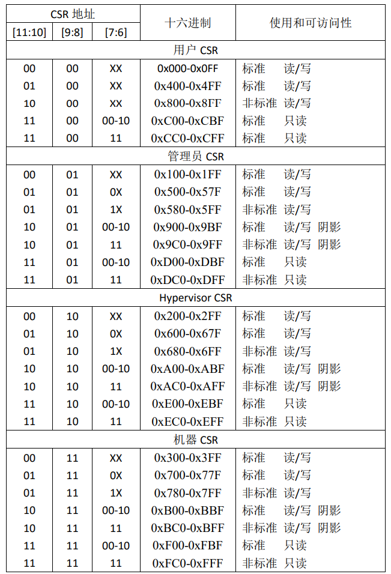
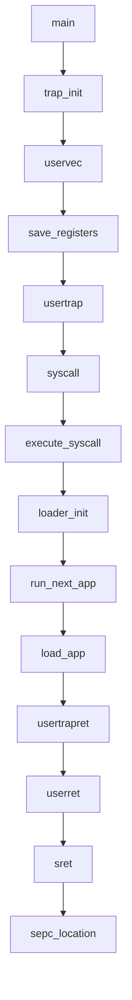

# 第二章

## 开始以前

### RISC-V syscall

> exit is syscall 93
>
> write is syscall 64

* 精简指令集

* 扩展

* 模块化

如果软件需要使用拓展的指令，RISC-V硬件会在软件中___捕获___并执行需要的功能，作为标准库的一部分。

* 定制化

---

* 板子拿给你，根据自己的使用场景可以随心所欲地添加自定义指令。

用似定长的变长指令集。

* 大多数时候是4字节定长指令
* 通过模块化拓展支持变长指令（同时实现隔离）

#### 什么是架构和具体实现的分离？？？

简单来说就是将系统架构的各部分分离开单独进行开发。可以看看Linux的不同子系统。

### RISC-V体系结构介绍

#### 指令集拓展

最小指令集合: RV32I, RV64I 

根据功能需要选择对应的拓展，确保指令集的简洁。

#### 基本概念

##### 执行环境接口（EEI）

> 包括程序的初始状态、CPU的类型与数量、支持的S模式、内存和I/O的可访问性与属性、每个CPU上执行指令的行为以及异常的处理等

一个EEI可由纯硬件、纯软件或软硬件结合实现

##### 哈特

> 表示一个CPU的执行线程。

近似于x86的SMT（超线程），Arm中的PE（处理机）

~~现目前市面上的处理器只需要了解一个物理核就一个执行线程（哈特）,技术上并未实现超线程~~

##### 处理器模式

1. U 用户模式
2. S 特权模式 OS内核
3. M 机器模式 SBI固件

##### SBI服务

> 硬件共性功能的抽象。

就是对硬件的抽象和提供接口服务。类似于系统调用。

#### 通用寄存器

| 通用寄存器 |  别名  | 特殊用途                                     |
| :--------: | :----: | :------------------------------------------- |
|     x0     |  zero  | 源寄存器/目标寄存器                          |
|     x1     |   ra   | 链接寄存器，保持函数返回地址                 |
|     x2     |   sp   | 栈帧寄存器，指向栈的地址                     |
|     x3     |   gp   | 全局寄存器，松弛链接优化                     |
|     x4     |   tp   | 线程寄存器，存放指向task_struct的指针        |
|   x5~x7    | t0~t6  | 临时寄存器                                   |
|   x8~x9    | s0~s11 | 函数调用如使用到需要保存到栈里；s0可作栈指针 |
|  x10~x17   | a0~a7  | 函数调用时传递参数和返回值                   |

#### 系统寄存器

1. M模式的系统寄存器
2. S模式的系统寄存器
3. U模式的系统寄存器

通过CSR指令访问系统寄存器

触发非法指令异常的操作：

1. 访问不存在/未实现
2. 写入只读
3. 越级访问

## 正片

### 特权级机制

#### 主要用途（对应用程序而言）

* 保证应用程序不能访问分配给其之外的内存地址空间
* 保证应用程序不能执行可能破坏系统的指令/影响系统的正常运行
* 保证应用程序能得到操作系统的服务/正确的软件执行环境
* 保证当应用程序执行出错的时候，可以在批处理操作系统中杀死该应用并加载运行下一个应用

#### 实现的思路

规定不同安全等级的执行环境，指出可能影响计算机系统的指令属于更底层的特权级且限定这些指令在底层的执行环境执行。当出现越级指令时，触发异常报错。

通过函数调用的方式为上层执行环境的程序提供底层环境的服务。

例如：

>  设定ecall和eret
>
> ecall：具有用户态到内核态的执行环境切换能力的函数调用指令
>
> eret ：具有内核态到用户态的执行环境切换能力的函数返回指令

#### RISC-V特权级

| 级别 | 编码 | 名称                                |
| ---- | ---- | ----------------------------------- |
| 0    | 00   | 用户/应用模式 (U, User/Application) |
| 1    | 01   | 监督模式 (S, Supervisor)            |
| 2    | 10   | 虚拟监督模式 (H, Hypervisor)        |
| 3    | 11   | 机器模式 (M, Machine)               |

* H模式特权规范并未制定完成发布，因此不会涉及

异常一览表如下

| Interrupt | Exception Code | Description                    |
| --------- | -------------- | ------------------------------ |
| 0         | 0              | Instruction address misaligned |
| 0         | 1              | Instruction access fault       |
| 0         | 2              | Illegal instruction            |
| 0         | 3              | Breakpoint                     |
| 0         | 4              | Load address misaligned        |
| 0         | 5              | Load access fault              |
| 0         | 6              | Store/AMO address misaligned   |
| 0         | 7              | Store/AMO access fault         |
| 0         | 8              | Environment call from U-mode   |
| 0         | 9              | Environment call from S-mode   |
| 0         | 11             | Environment call from M-mode   |
| 0         | 12             | Instruction page fault         |
| 0         | 13             | Load page fault                |
| 0         | 15             | Store/AMO page fault           |

#### 特权指令

| 指令                   | 含义                                                         |
| :----------------------: | ------------------------------------------------------------ |
| sret                   | 从 S 模式返回 U 模式：在 U 模式下执行会产生非法指令异常      |
| wfi                    | 处理器在空闲时进入低功耗状态等待中断：在 U 模式下执行会产生非法指令异常 |
| sfence.vma             | 刷新 TLB 缓存：在 U 模式下执行会产生非法指令异常             |
| 访问 S 模式 CSR 的指令 | 通过访问 [sepc/stvec/scause/sscartch/stval/sstatus/satp等CSR](http://rcore-os.cn/rCore-Tutorial-Book-v3/chapter2/4trap-handling.html#term-s-mod-csr) 来改变系统状态：在 U 模式下执行会产生非法指令异常 |

以下是进入 S 特权级 Trap 的相关 CSR

| CSR 名  | 该 CSR 与 Trap 相关的功能                                    |
| ------- | ------------------------------------------------------------ |
| sstatus | `SPP` 等字段给出 Trap 发生之前 CPU 处在哪个特权级（S/U）等信息 |
| sepc    | 当 Trap 是一个异常的时候，记录 Trap 发生之前执行的最后一条指令的地址 |
| scause  | 描述 Trap 的原因                                             |
| stval   | 给出 Trap 附加信息                                           |
| stvec   | 控制 Trap 处理代码的入口地址                                 |

### 应用程序系统调用的执行流程

1. main函数开始执行
2. 调用trap_init函数进行中断（trap）处理初始化
3. uservec函数被调用以设置用户模式固有的中断处理程序（handler）
4. 中断处理程序保存当前用户空间的寄存器（register）值到TRAPFRAME结构体中
5. 跳转到usertrap()函数进行处理
6. 如果需要执行系统调用，则用户程序调用syscall()函数
7. 执行具体的系统调用如SYS_write或SYS_exit
8. loader_init()函数初始化app的加载器
9. switch_app()函数切换到app的上下文
10. 加载app并启动它
11. 当app结束后，返回用户态的usertrapret()函数
12. userret()函数被调用以进行用户模式下的栈操作
13. sret指令被执行，完成从内核态到用户态的转换
14. PC跳转到sepc指定的位置

执行到内核main -> trap_init() -> uservec -> 保存用户空间的寄存器到 TRAPFRAME 结构 -> 跳转到usertrap() -> syscall()->执行具体的系统调用如**SYS_write**或**SYS_exit** -> loader_init() -> run_next_app() 切换app-> load_app() ->返回用户态usertrapret() -> userret() -> 其中的sret指令完成返回用户态，并将PC移动到sepc指定的位置

#### 问1：何时是U态到S态

当 CPU 在用户态特权级（即U态）运行应用程序，执行到 Trap上下文，切换到内核态特权级(即S态)。具体来讲，当执行到上面执行流程中的uservec()时就开始从U态切换到S态的准备，当执行到usertrap()调用syscall()时进入S态完成。

#### 问2：第一个用户程序是怎么开始的

1. 系统获得用户程序的数量和位置（`link_app.S`的`_app_num`和`app_0_start`）
2. 将用户程序加载（链接）到指定物理内存地址(这里涉及到第一章中的分段的内存空间布局）。具体来说，静态分配给程序一定的内存空间，并在`run_next_app`函数初始化应用程序对应的`trapframe`，并将用户栈对应的起始位置写入`trapframe`之中的`sp`寄存器，来让程序指向自己用户栈起始的位置，这样应用程序进入就绪状态。
3. 读取指定内存位置的bin文件来开始执行

---

#### 图片来源

1.  [RISC-V体系结构编程与实践](https://www.bilibili.com/video/BV1fT411d71G/?spm_id_from=333.999.0.0)
2.  [RISC-V Privileged Architecture](https://ica123.com/archives/5717)

