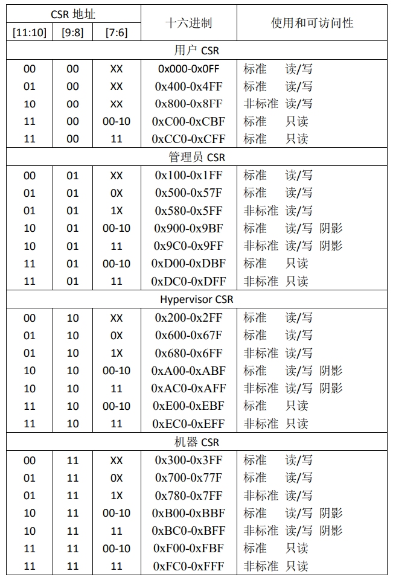

# 第二章

## 开始以前

### RISC-V syscall

exit is syscall 93

write is syscall 64

* 精简指令集

* 扩展

* 模块化

如果软件需要使用拓展的指令，RISC-V硬件会在软件中___捕获___并执行需要的功能，作为标准库的一部分。

* 定制化

* 板子拿给你，根据自己的使用场景可以随心所欲地添加自定义指令。

用似定长的变长指令集。

* 大多数时候是4字节定长指令
* 通过模块化拓展支持变长指令（同时实现隔离）

#### 什么是架构和具体实现的分离？？？

简单来说就是将系统架构的各部分分离开单独进行开发。可以看看Linux的不同子系统。

### 系统学习路程图

### RISC-V体系结构介绍

#### 指令集拓展

最小指令集合: RV32I, RV64I 

根据功能需要选择对应的拓展，确保指令集的简洁。

#### 基本概念

##### 执行环境接口（EEI）

> 包括程序的初始状态、CPU的类型与数量、支持的S模式、内存和I/O的可访问性与属性、每个CPU上执行指令的行为以及异常的处理等

一个EEI可由纯硬件、纯软件或软硬件结合实现

##### 哈特

> 表示一个CPU的执行线程。

近似于x86的SMT（超线程），Arm中的PE（处理机）

~~现目前市面上的处理器只需要了解一个物理核就一个执行线程（哈特）,技术上并未实现超线程~~

##### 处理器模式

1. M 机器模式 SBI固件
2. S 特权模式 OS内核
3. U 用户模式

##### SBI服务

> 硬件共性功能的抽象。

就是对硬件的抽象和提供接口服务。类似于系统调用。

#### 通用寄存器

| 通用寄存器 |  别名  | 特殊用途                                     |
| :--------: | :----: | :------------------------------------------- |
|     x0     |  zero  | 源寄存器/目标寄存器                          |
|     x1     |   ra   | 链接寄存器，保持函数返回地址                 |
|     x2     |   sp   | 栈帧寄存器，指向栈的地址                     |
|     x3     |   gp   | 全局寄存器，松弛链接优化                     |
|     x4     |   tp   | 线程寄存器，存放指向task_struct的指针        |
|   x5~x7    | t0~t6  | 临时寄存器                                   |
|   x8~x9    | s0~s11 | 函数调用如使用到需要保存到栈里；s0可作栈指针 |
|  x10~x17   | a0~a7  | 函数调用时传递参数和返回值                   |

#### 系统寄存器

1. M模式的系统寄存器
2. S模式的系统寄存器
3. U模式的系统寄存器

通过CSR指令访问系统寄存器

触发非法指令异常的操作：

1. 访问不存在/未实现
2. 写入只读
3. 越级访问

#### 图片来源

1.  [RISC-V体系结构编程与实践](https://www.bilibili.com/video/BV1fT411d71G/?spm_id_from=333.999.0.0)
2.  [RISC-V Privileged Architecture](https://ica123.com/archives/5717)
