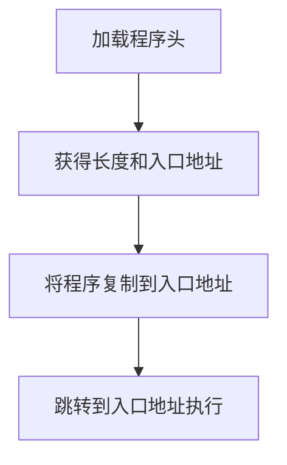

# 保护模式进阶

## 获取物理内存容量

### 利用 BIOS 中断 0x15 子功能 0xe820 获取内存

内存信息的内容是用地址范围描述符来描述的，用于存储这种描述符的结构称之为地址范围描述符（Address Range Descriptor Structure，ARDS）。


此结构中的字段大小都是 4 字节，共 5 个字段，所以此结构大小为 20 字节。每次 int 0x15 之后，BIOS就返回这样一个结构的数据。注意，ARDS 结构中用 64 位宽度的属性来描述这段内存基地址（起始地址）及其长度，所以表中的基地址和长度都分为低 32 位和高 32 位两部分。

其中的 Type 字段用来描述这段内存的类型，这里所谓的类型是说明这段内存的用途，即其是可以被
操作系统使用，还是保留起来不能用。Type 字段的具体意义见表 5-2。


为什么 BIOS 会按类型来返回内存信息呢？原因是这段内存可能是。

* 系统的 ROM。
* ROM 用到了这部分内存。
*  设备内存映射到了这部分内存。
*  由于某种原因，这段内存不适合标准设备使用。


（1）填写好“调用前输入”中列出的寄存器。
（2）执行中断调用 int 0x15。
（3）在 CF 位为 0 的情况下，“返回后输出”中对应的寄存器便会有对应的结果。

``` assembly
   ;
   ; 略
   ;
;-------  int 15h eax = 0000E820h ,edx = 534D4150h ('SMAP') 获取内存布局  -------
;es:di存放缓冲区地址，es在mbr中已经赋值了(0)，45行对di赋值。
   xor ebx, ebx		      ;第一次调用时，ebx值要为0
   mov edx, 0x534d4150	      ;edx只赋值一次，循环体中不会改变 固定签名，16进制数字字符串是SMAP的ASCII
   mov di, ards_buf	      ;ards结构缓冲区
.e820_mem_get_loop:	      ;循环获取每个ARDS内存范围描述结构
   mov eax, 0x0000e820	      ;执行int 0x15后,eax值变为0x534d4150,所以每次执行int前都要更新为子功能号。
   mov ecx, 20		      ;ARDS地址范围描述符结构大小是20字节 每次执行完ecx会改变，所以每次都需要给ecx重新赋值
   int 0x15
   add di, cx		      ;使di增加20字节指向缓冲区中新的ARDS结构位置
   inc word [ards_nr]	      ;记录ARDS数量  每次得到一个ARDS后，便将ards_nr加1,记录ARDS的个数
   cmp ebx, 0		      ;若ebx为0且cf不为1,这说明ards全部返回，当前已是最后一个
   jnz .e820_mem_get_loop
   ;
   ; 接下文找最大的内存块
```

找最大的内存块

> 因为我们这里实现的是32位系统，因此只需要求`BaseAddrLow`和`LengthLow`的和。

``` assembly
   ;
   ; 接上文
;56～69行是找出最大的内存块。思路是对每一个ARDS结构中的BaseAddrLow与LengthLow相加求和，遍历完所有ARDS，值最大的则为内存容量，由于BaseAddrLow+LengthLow的单位是字节而无需转换，之后便直接跳转到.mem_get_ok，将此容量数写入变量total_mem_bytes
;在所有ards结构中，找出(base_add_low + length_low)的最大值，即内存的容量。
   mov cx, [ards_nr]	      ;遍历每一个ARDS结构体,循环次数是ARDS的数量
   mov ebx, ards_buf 
   xor edx, edx		      ;edx为最大的内存容量,在此先清0
.find_max_mem_area:	      ;无须判断type是否为1,最大的内存块一定是可被使用
   mov eax, [ebx]	      ;base_add_low
   add eax, [ebx+8]	      ;length_low
   add ebx, 20		      ;指向缓冲区中下一个ARDS结构
   cmp edx, eax		      ;冒泡排序，找出最大,edx寄存器始终是最大的内存容量
   jge .next_ards
   mov edx, eax		      ;edx为总内存大小
.next_ards:
   loop .find_max_mem_area
   jmp .mem_get_ok

   .mem_get_ok:
   mov [total_mem_bytes], edx	 ;将内存换为byte单位后存入total_mem_bytes处。
   ;
   ; 略
   ;
```

## 分页机制


### 原理

通过映射使得逻辑上连续的地址在对应的物理地址上（可以）不连续。

### 作用

* 将线性地址转换成物理地址。
* 用大小相等的页代替大小不等的段。


### 一级页表


### 二级页表


页目录项（Page Directory Entry, PDE）


### 页目录项及页表项结构


> 因为页目录项和页表项中的都是物理页地址，标准页大小是 4KB，故地址都是 4K 的倍数，也就是地址的低 12 位是 0，所以只需要记录物理地址高 20 位就可以啦。这样省出来的 12 位（第 0～11 位）可以用来添加其他属性。

#### P

Present，意为存在位。若为 1 表示该页存在于物理内存中，若为 0 表示该表不在物理内存中。操作系统的页式虚拟内存管理便是通过 P 位和相应的 pagefault 异常来实现的。

#### RW

Read/Write，意为读写位。若为 1 表示可读可写，若为 0 表示可读不可写。

#### US

User/Supervisor，意为普通用户/超级用户位。若为 1 时，表示处于 User 级，任意级别（0、1、2、3）特权的程序都可以访问该页。若为 0，表示处于 Supervisor 级，特权级别为 3 的程序不允许访问该页，该页只允许特权级别为 0、1、2 的程序可以访问。

#### PWT

Page-level Write-Through，意为页级通写位，也称页级写透位。若为 1 表示此项采用通写方式，表示该页不仅是普通内存，还是高速缓存。此项和高速缓存有关，“通写”是高速缓存的一种工作方式，本位用来间接决定是否用此方式改善该页的访问效率。这里咱们直接置为 0 就可以啦。

#### PCD

Page-level Cache Disable，意为页级高速缓存禁止位。若为 1 表示该页启用高速缓存，为 0 表示禁止将该页缓存。这里咱们将其置为 0。

#### A

Accessed，意为访问位。若为 1 表示该页被 CPU 访问过啦，所以该位是由 CPU 设置的。还记得段描述符中的 A 位和 P 位吗？这两位在一起可以实现段式虚拟内存管理。和它们一样，这里页目录项和页表项中的 A 位也可以用来记录某一内存页的使用频率（操作系统定期将该位清 0，统计一段时间内变成 1 的次数），从而当内存不足时，可以将使用频率较低的页面换出到外存（如硬盘），同时将页目录项或页表项的 P位置 0，下次访问该页引起 pagefault 异常时，中断处理程序将硬盘上的页再次换入，同时将 P 位置 1。

#### D

Dirty，意为脏页位。当 CPU 对一个页面执行写操作时，就会设置对应页表项的 D 位为 1。此项仅针对页表项有效，并不会修改页目录项中的 D 位。

#### PAT

Page Attribute Table，意为页属性表位，能够在页面一级的粒度上设置内存属性。比较复杂，将此位置 0 即可。

#### G

Global，意为全局位。由于内存地址转换也是颇费周折，先得拆分虚拟地址，然后又要查页目录，又要查页表的，所以为了提高获取物理地址的速度，将虚拟地址与物理地址转换结果存储在 TLB（Translation Lookaside Buffer）中，TLB 以后咱们会细说。在此先知道 TLB 是用来缓存地址转换结果的高速缓存就 ok 啦。此 G 位用来指定该页是否为全局页，为 1 表示是全局页，为 0 表示不是全局页。若为全局页，该页将在高速缓存 TLB 中一直保存，给出虚拟地址直接就出物理地址啦，无需那三步骤转换。由于 TLB 容量比较小（一般速度较快的存储设备容量都比较小），所以这里面就存放使用频率较高的页面。顺便说一句，清空 TLB 有两种方式，一是用 invlpg 指令针对单独虚拟地址条目清理，或者是重新加载 cr3 寄存器，这将直接清空 TLB。

#### AVL

Available，表示可用，谁可以用？当然是软件，操作系统可用该位，CPU 不理会该位的值，那咱们也不理会吧。

### 启用分页模式

1. 准备好页目录表及页表。
2. 将页表地址写入控制寄存器 cr3。
3. 寄存器 CR0 的 PG 位置 1。


CR0 的 PG 位在其结构的第 31 位。

虚拟地址空间的 0～3GB 是用户进程，3GB～4GB 是操作系统。


``` assembly
;-------------   创建页目录及页表   ---------------
setup_page:
;先把页目录占用的空间逐字节清0
   mov ecx, 4096
   mov esi, 0
.clear_page_dir:
   mov byte [PAGE_DIR_TABLE_POS + esi], 0
   inc esi
   loop .clear_page_dir

;开始创建页目录项(PDE)
.create_pde:				     ; 创建Page Directory Entry
   mov eax, PAGE_DIR_TABLE_POS
   add eax, 0x1000 			     ; 此时eax为第一个页表的位置及属性
   mov ebx, eax				     ; 此处为ebx赋值，是为.create_pte做准备，ebx为基址。

;   下面将页目录项0和0xc00都存为第一个页表的地址，
;   一个页表可表示4MB内存,这样0xc03fffff以下的地址和0x003fffff以下的地址都指向相同的页表，
;   这是为将地址映射为内核地址做准备
   or eax, PG_US_U | PG_RW_W | PG_P	     ; 页目录项的属性RW和P位为1,US为1,表示用户属性,所有特权级别都可以访问.
   mov [PAGE_DIR_TABLE_POS + 0x0], eax       ; 第1个目录项,在页目录表中的第1个目录项写入第一个页表的位置(0x101000)及属性(7)
   mov [PAGE_DIR_TABLE_POS + 0xc00], eax     ; 一个页表项占用4字节,0xc00表示第768个页表占用的目录项,0xc00以上的目录项用于内核空间,
					     ; 也就是页表的0xc0000000~0xffffffff共计1G属于内核,0x0~0xbfffffff共计3G属于用户进程.
   sub eax, 0x1000
   mov [PAGE_DIR_TABLE_POS + 4092], eax	     ; 使最后一个目录项指向页目录表自己的地址

;下面创建页表项(PTE)
   mov ecx, 256				     ; 1M低端内存 / 每页大小4k = 256
   mov esi, 0
   mov edx, PG_US_U | PG_RW_W | PG_P	     ; 属性为7,US=1,RW=1,P=1
.create_pte:				     ; 创建Page Table Entry
   mov [ebx+esi*4],edx			     ; 此时的ebx已经在上面通过eax赋值为0x101000,也就是第一个页表的地址 
   add edx,4096      ; edx
   inc esi
   loop .create_pte

;创建内核其它页表的PDE
   mov eax, PAGE_DIR_TABLE_POS
   add eax, 0x2000 		     ; 此时eax为第二个页表的位置
   or eax, PG_US_U | PG_RW_W | PG_P  ; 页目录项的属性US,RW和P位都为1
   mov ebx, PAGE_DIR_TABLE_POS
   mov ecx, 254			     ; 范围为第769~1022的所有目录项数量
   mov esi, 769
.create_kernel_pde:
   mov [ebx+esi*4], eax
   inc esi
   add eax, 0x1000
   loop .create_kernel_pde
   ret
```

---

## 加载内核/程序




### elf格式的二进制文件


程序头表

节头表

程序头表（program header table）中的元素全是程序头（program header），而节头表（section header table）中的元素全是节头（section header）。

> ELF header 是个用来描述各种“头”的“头”，程序头表和节头表中的元素也是程序头和节头，可见，elf 文件格式的核心思想就是头中嵌头，是种层次化结构的格式。


> ELF 文件格式依然分为文件头和文件体两部分，只是该文件头相对稍显复杂，类似层次化结构，先用个 ELF header 从“全局上”给出程序文件的组织结构，概要出程序中其他头表的位置大小等信息，如程序头表的大小及位置、节头表的大小及位置。然后，各个段和节的位置、大小等信息再分别从“具体的”程序头表和节头表中予以说明。


可以使用 file 命令查看 elf 格式的可执行程序是 LSB 还是 MSB （区分大小端）

e_type 占用 2 字节，是用来指定 elf 目标文件的类型，可能的取值见表 5-10


e_machine 占用 2 字节，用来描述 elf 目标文件的体系结构类型，也就是说该文件要在哪种硬件平台（哪种机器）上才能运行。


e_version 占用 4 字节，用来表示版本信息。
e_entry 占用 4 字节，用来指明操作系统运行该程序时，将控制权转交到的虚拟地址。
e_phoff 占用 4 字节，用来指明程序头表（program header table）在文件内的字节偏移量。如果没有程序头表，该值为 0。
e_shoff 占用 4 字节，用来指明节头表（section header table）在文件内的字节偏移量。若没有节头表，该值为 0。
e_flags 占用 4 字节，用来指明与处理器相关的标志，本书用不到那么多的内容，具体取值范围，有兴趣的同学还是要参考/usr/include/elf.h。
e_ehsize 占用 2 字节，用来指明 elf header 的字节大小。
e_phentsize 占用 2 字节，用来指明程序头表（program header table）中每个条目（entry）的字节大小，即每个用来描述段信息的数据结构的字节大小，该结构是后面要介绍的 struct Elf32_Phdr。
e_phnum 占用 2 字节，用来指明程序头表中条目的数量。实际上就是段的个数。
e_shentsize 占用 2 字节，用来指明节头表（section header table）中每个条目（entry）的字节大小，即每个用来描述节信息的数据结构的字节大小。
e_shnum 占用 2 字节，用来指明节头表中条目的数量。实际上就是节的个数。
e_shstrndx 占用 2 字节，用来指明 string name table 在节头表中的索引 index。

程序头表中的条目的数据结构名为 struct Elf32_Phdr，用来描述各个段的信息


p_type 占用 4 字节，用来指明程序中该段的类型。


p_offset 占用 4 字节，用来指明本段在文件内的起始偏移字节。
p_vaddr 占用 4 字节，用来指明本段在内存中的起始虚拟地址。
p_paddr 占用 4 字节，仅用于与物理地址相关的系统中，因为 System V 忽略用户程序中所有的物理地址，所以此项暂且保留，未设定。
p_filesz 占用 4 字节，用来指明本段在文件中的大小。
p_memsz 占用 4 字节，用来指明本段在内存中的大小。

p_flags 占用 4 字节，用来指明与本段相关的标志。


p_align 占用 4 字节，用来指明本段在文件和内存中的对齐方式。如果值为 0 或 1，则表示不对齐。否则 p_align 应该是 2 的幂次数。


---

表示在内存中相对入口的偏移，所以是 0

``` shell
     1  //int main(void) {
     2  int _start(void) {
     3     while(1);
     4     return 0;
     5  }
===========================================
     1          .file   "start.c"
     2          .text
     3  .globl _start
     4          .type   _start, @function
     5  _start:
     6  .LFB0:
     7          .cfi_startproc
     8          pushq   %rbp
     9          .cfi_def_cfa_offset 16
    10          movq    %rsp, %rbp
    11          .cfi_offset 6, -16
    12          .cfi_def_cfa_register 6
    13  .L2:
    14          jmp     .L2
    15          .cfi_endproc
    16  .LFE0:
    17          .size   _start, .-_start
    18          .ident  "GCC: (Ubuntu/Linaro 4.4.7-8ubuntu1) 4.4.7"
    19          .section        .note.GNU-stack,"",@progbits
```

