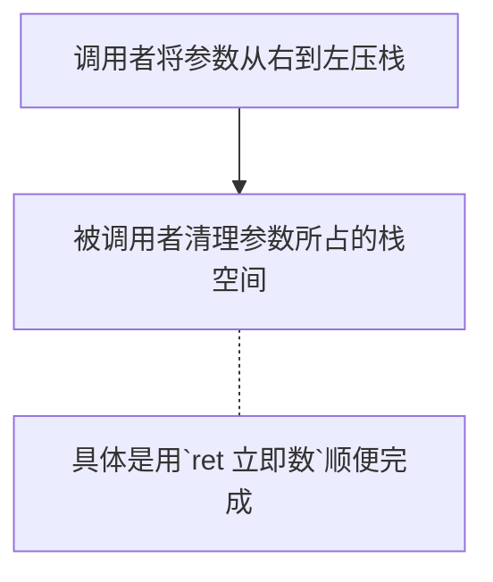
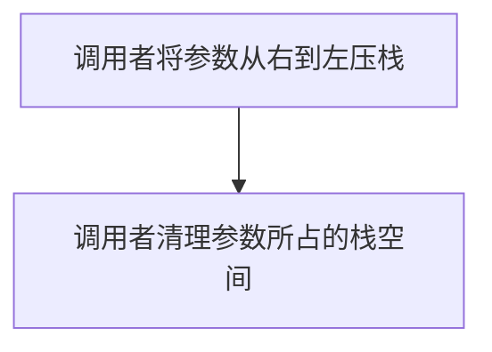

# 完善内核

## 函数调用规定

使用栈来保持参数

在汇编语言中存在调用存入参数的顺序问题，需要对此做出约定

stdcall 约定 



> 这里的清理并不需要将栈中内容置 0，将栈顶指针恢复即可

cdecl 约定



## 混合编程

（1）单独的汇编代码文件与单独的 C 语言文件分别编译成目标文件后，一起链接成可执行程序。
（2）在 C 语言中嵌入汇编代码，直接编译生成可执行程序。

调用“系统调用”有两种方式。
（1）将系统调用指令封装为 c 库函数，通过库函数进行系统调用，操作简单。
（2）不依赖任何库函数，直接通过汇编指令 int 与操作系统通信。

当输入的参数小于等于 5 个时，Linux 用寄存器传递参数。当参数个数大于 5 个时，把参数按照顺序放入连续的内存区域，并将该区域的首地址放到 ebx 寄存器。
（1）ebx 存储第 1 个参数。
（2）ecx 存储第 2 个参数。
（3）edx 存储第 3 个参数。
（4）esi 存储第 4 个参数。
（5）edi 存储第 5 个参数。

在汇编语言中导出符号名用`global`关键字，这在之前说_start 时大伙已有所耳闻，`global`将符号导出为全局属性，对程序中的所有文件可见，这样其他外部文件中也可以引用被`global`导出的符号啦，无论该符号是函数，还是变量。

* 在汇编代码中导出符号供外部引用是用的关键字 global，引用外部文件的符号是用的关键字  extern。

* 在 C 代码中只要将符号定义为全局便可以被外部引用（一般情况下无需用额外关键字修饰，具体请参考 C 语言手册），引用外部符号时用 extern 声明即可。

## 实现打印函数


前四组寄存器属于分组，它们有一个特征，就是被分成了两类寄存器，即 Address Register 和Data Register。对这类分组的寄存器操作方法是先在 Address Register 中指定寄存器的索引值，用来确定所操作的寄存器是哪个，然后在 Data Register 寄存器中对所索引的寄存器进行读写操作。


#### I/OAS（Input/Output Address Select）

此位用来选择 CRT controller 寄存器组的地址，这里是指 Address Register 和 Data Register 的地址。

##### 当此位为 0 时

CRT controller 寄存器组的端口地址被设置为 0x3Bx，结合表 6-2，Address Register 和 Data Register 的端口地址实际值为 3B4h-3B5h。并且为了兼容 monochrome 适配器（显卡），Input Status #1 Register 寄存器的端口地址被设置为 0x3BA。

Feature Control register 寄存器写端口地址为 3BAh。

##### 当此位为 1 时

CRT controller 寄存器组的端口地址被设置为 0x3Dx，结合表 6-2，Address Register 和 Data Register 的端口地址实际值为 3D4h-3D5h。并且为了兼容 color/graphics 适配器（显卡），Input Status #1Register 寄存器的端口地址被设置为 0x3DA。

Feature Control register 寄存器写端口地址为 3DAh。


默认情况下，Miscellaneous Output Register 寄存器的值为 0x67，其他字段不管，咱们只关注这最重要的 I/OAS 位，其值为 1。也就是说：

* CRT controller 寄存器组的 Address Register 的端口地址为 0x3D4，Data Register 的端口地址 0x3D5。
* Input Status #1Register 寄存器的端口地址被设置为 0x3DA。
* Feature Control register 寄存器的写端口是 0x3DA。

#### 拓展，闲下来可以查查


### 实现单个字符打印

新建了个 lib 目录用来专门存放各种库文件, 在 lib 目录下还建立了 user 和 kernel 两个子目录，以后供内核使用的库文件就放在 lib/kernel/下，lib/user/中是用户进程使用的库文件。

PUSHAD 是 push all double，该指令压入所有双字长的寄存器，这里的“所有”一共是 8 个，它们的入栈先后顺序是：EAX->ECX->EDX->EBX-> ESP-> EBP->ESI->EDI，EAX 是最先入栈。

光标是字符的坐标，是一维的线性坐标，是屏幕上所有字符以 0 为起始的顺序。在默认的 80*25 模式下，每行 80 个字符共 25 行，屏幕上可以容纳 2000 个字符，故该坐标值的范围是 0～1999。第 0 行的所有字符坐标是 0～24，第 1 行的所有字符坐标是 25～49，以此类推，最后一行的所有字符是 1975～1999。由于一个字符占用 2 字节，所以光标乘以 2 后才是字符在显存中的地址。

光标的坐标位置是存放在光标坐标寄存器中的。

光标位置并不会自动更新，因为光标坐标寄存器是可写的，如果需要的话，程序员可以自己来维护光标的坐标。

#### 第一步 读取光标坐标寄存器，获取光标坐标值


表 6-5CRT Controller Data Registers中索引为 0Eh 的 Cursor Location High Register 寄存器和索引为 0Fh 的 Cursor Location Low Register 寄存器，这两个寄存器都是 8 位长度，分别用来存储光标坐标的低 8 位和高 8 位地址。

访问 CRT controller 寄存器组的寄存器，需要先往端口地址为 0x3D4 的 Address Register 寄存器中写入寄存器的索引，再从端口地址为 0x3D5 的 Data Register 寄存器读、写数据。

``` assembly
;;;;;;;;;  获取当前光标位置 ;;;;;;;;;
   ;先获得高8位
   mov dx, 0x03d4  ;索引寄存器
   mov al, 0x0e	   ;用于提供光标位置的高8位
   out dx, al
   mov dx, 0x03d5  ;通过读写数据端口0x3d5来获得或设置光标位置 
   in al, dx	   ;得到了光标位置的高8位
   mov ah, al

   ;再获取低8位
   mov dx, 0x03d4
   mov al, 0x0f
   out dx, al
   mov dx, 0x03d5 
   in al, dx
   
   ;将光标存入bx
   mov bx, ax
```

* 注意：对于 in 指令，如果源操作是 8 位寄存器，目的操作数必须是al，如果源操作数是 16 位寄存器，目的操作数必须是 ax。

#### 获取栈中压入的字符的 ASCII 码，也就是待打印的字符

``` assembly
   ;下面这行是在栈中获取待打印的字符
   mov ecx, [esp + 36] ; pushad压入4×8＝32字节,加上主调函数的返回地址4字节(call put_char函数时压入栈),故esp+36字节=
```

#### 判断参数是什么字符

``` assembly
   cmp cl, 0xd	; CR是0x0d,LF是0x0a
   jz .is_carriage_return
   cmp cl, 0xa
   jz .is_line_feed

   cmp cl, 0x8				  ;BS(backspace)的asc码是8
   jz .is_backspace
   jmp .put_other	   
```


#### 滚屏

什么时候需要？

1. 如果下次打印字符的坐标不小于 2000（在咱们的应用中顶多是等于 2000 的情况）

2. 新的光标值超出了屏幕右下角最后一个字符的位置。
3. 最后一行中任意位置有回车或换行符。

可用两个思路实现

1. 移动显存显示字符的初始地址，"自动"从该地址起向后显示2000个字符
1. 固定显存的首地址，更新缓存的2000个字符

采用思路2，设计步骤为：

1. 将第 1～24 行的内容整块搬到第 0～23 行，也就是把第 0 行的数据覆盖。
2. 再将第 24 行，也就是最后一行的字符用空格覆盖，这样它看上去是一个新的空行。
3. 把光标移到第 24 行也就是最后一行行首。

实现光标的回车 Carriage Return


实现光标的换行 Line Feed


