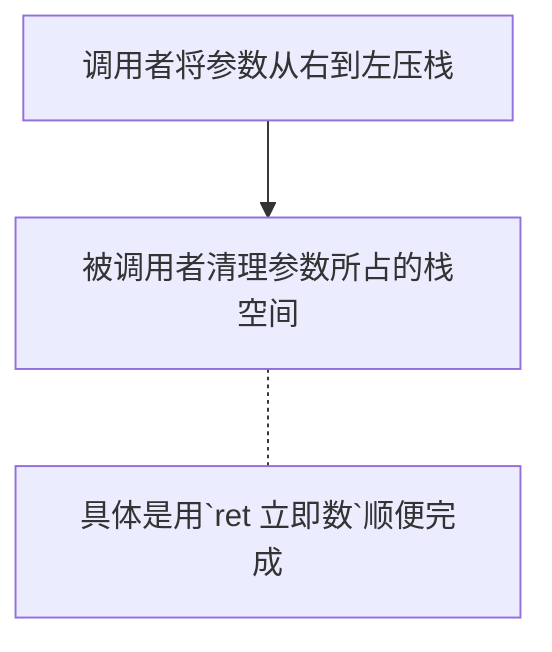
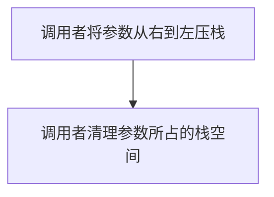
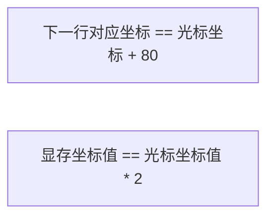
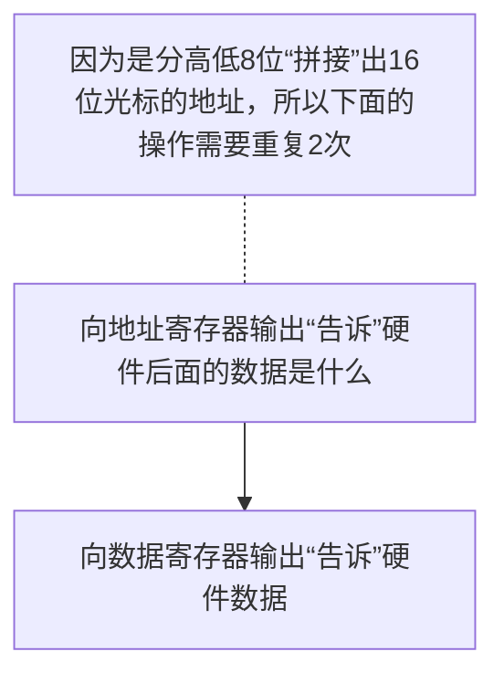

# 完善内核

## 函数调用规定

使用栈来保持参数

在汇编语言中存在调用存入参数的顺序问题，需要对此做出约定

stdcall 约定 



> 这里的清理并不需要将栈中内容置 0，将栈顶指针恢复即可

cdecl 约定



## 混合编程

（1）单独的汇编代码文件与单独的 C 语言文件分别编译成目标文件后，一起链接成可执行程序。
（2）在 C 语言中嵌入汇编代码，直接编译生成可执行程序。

调用“系统调用”有两种方式。
（1）将系统调用指令封装为 c 库函数，通过库函数进行系统调用，操作简单。
（2）不依赖任何库函数，直接通过汇编指令 int 与操作系统通信。

当输入的参数小于等于 5 个时，Linux 用寄存器传递参数。当参数个数大于 5 个时，把参数按照顺序放入连续的内存区域，并将该区域的首地址放到 ebx 寄存器。
（1）ebx 存储第 1 个参数。
（2）ecx 存储第 2 个参数。
（3）edx 存储第 3 个参数。
（4）esi 存储第 4 个参数。
（5）edi 存储第 5 个参数。

在汇编语言中导出符号名用`global`关键字，这在之前说_start 时大伙已有所耳闻，`global`将符号导出为全局属性，对程序中的所有文件可见，这样其他外部文件中也可以引用被`global`导出的符号啦，无论该符号是函数，还是变量。

* 在汇编代码中导出符号供外部引用是用的关键字 global，引用外部文件的符号是用的关键字  extern。

* 在 C 代码中只要将符号定义为全局便可以被外部引用（一般情况下无需用额外关键字修饰，具体请参考 C 语言手册），引用外部符号时用 extern 声明即可。

## 实现打印函数


前四组寄存器属于分组，它们有一个特征，就是被分成了两类寄存器，即 Address Register 和Data Register。对这类分组的寄存器操作方法是先在 Address Register 中指定寄存器的索引值，用来确定所操作的寄存器是哪个，然后在 Data Register 寄存器中对所索引的寄存器进行读写操作。


#### I/OAS（Input/Output Address Select）

此位用来选择 CRT controller 寄存器组的地址，这里是指 Address Register 和 Data Register 的地址。

##### 当此位为 0 时

CRT controller 寄存器组的端口地址被设置为 0x3Bx，结合表 6-2，Address Register 和 Data Register 的端口地址实际值为 3B4h-3B5h。并且为了兼容 monochrome 适配器（显卡），Input Status #1 Register 寄存器的端口地址被设置为 0x3BA。

Feature Control register 寄存器写端口地址为 3BAh。

##### 当此位为 1 时

CRT controller 寄存器组的端口地址被设置为 0x3Dx，结合表 6-2，Address Register 和 Data Register 的端口地址实际值为 3D4h-3D5h。并且为了兼容 color/graphics 适配器（显卡），Input Status #1Register 寄存器的端口地址被设置为 0x3DA。

Feature Control register 寄存器写端口地址为 3DAh。


默认情况下，Miscellaneous Output Register 寄存器的值为 0x67，其他字段不管，咱们只关注这最重要的 I/OAS 位，其值为 1。也就是说：

* CRT controller 寄存器组的 Address Register 的端口地址为 0x3D4，Data Register 的端口地址 0x3D5。
* Input Status #1Register 寄存器的端口地址被设置为 0x3DA。
* Feature Control register 寄存器的写端口是 0x3DA。

#### 拓展，闲下来可以查查


### 单个字符打印

新建了个 lib 目录用来专门存放各种库文件, 在 lib 目录下还建立了 user 和 kernel 两个子目录，以后供内核使用的库文件就放在 lib/kernel/下，lib/user/中是用户进程使用的库文件。

PUSHAD 是 push all double，该指令压入所有双字长的寄存器，这里的“所有”一共是 8 个，它们的入栈先后顺序是：EAX->ECX->EDX->EBX-> ESP-> EBP->ESI->EDI，EAX 是最先入栈。

光标是字符的坐标，是一维的线性坐标，是屏幕上所有字符以 0 为起始的顺序。在默认的 80*25 模式下，每行 80 个字符共 25 行，屏幕上可以容纳 2000 个字符，故该坐标值的范围是 0～1999。第 0 行的所有字符坐标是 0～24，第 1 行的所有字符坐标是 25～49，以此类推，最后一行的所有字符是 1975～1999。由于一个字符占用 2 字节，所以光标乘以 2 后才是字符在显存中的地址。

光标的坐标位置是存放在光标坐标寄存器中的。

光标位置并不会自动更新，因为光标坐标寄存器是可写的，如果需要的话，程序员可以自己来维护光标的坐标。

#### 第一步 读取光标坐标寄存器，获取光标坐标值


表 6-5CRT Controller Data Registers中索引为 0Eh 的 Cursor Location High Register 寄存器和索引为 0Fh 的 Cursor Location Low Register 寄存器，这两个寄存器都是 8 位长度，分别用来存储光标坐标的低 8 位和高 8 位地址。

访问 CRT controller 寄存器组的寄存器，需要先往端口地址为 0x3D4 的 Address Register 寄存器中写入寄存器的索引，再从端口地址为 0x3D5 的 Data Register 寄存器读、写数据。

``` assembly
;;;;;;;;;  获取当前光标位置 ;;;;;;;;;
   ;先获得高8位
   mov dx, 0x03d4  ;索引寄存器
   mov al, 0x0e	   ;用于提供光标位置的高8位
   out dx, al
   mov dx, 0x03d5  ;通过读写数据端口0x3d5来获得或设置光标位置 
   in al, dx	   ;得到了光标位置的高8位
   mov ah, al

   ;再获取低8位
   mov dx, 0x03d4
   mov al, 0x0f
   out dx, al
   mov dx, 0x03d5 
   in al, dx
   
   ;将光标存入bx
   mov bx, ax
```

* 注意：对于 in 指令，如果源操作是 8 位寄存器，目的操作数必须是al，如果源操作数是 16 位寄存器，目的操作数必须是 ax。

#### 获取栈中压入的字符的 ASCII 码，也就是待打印的字符

``` assembly
   ;下面这行是在栈中获取待打印的字符
   mov ecx, [esp + 36] ; pushad压入4×8＝32字节,加上主调函数的返回地址4字节(call put_char函数时压入栈),故esp+36字节=
```

#### 判断参数是什么字符

``` assembly
   cmp cl, 0xd	; CR是0x0d,LF是0x0a
   jz .is_carriage_return
   cmp cl, 0xa
   jz .is_line_feed

   cmp cl, 0x8				  ;BS(backspace)的asc码是8
   jz .is_backspace
   jmp .put_other	   
```


#### 滚屏

什么时候需要？

1. 如果下次打印字符的坐标不小于 2000（在咱们的应用中顶多是等于 2000 的情况）

2. 新的光标值超出了屏幕右下角最后一个字符的位置。
3. 最后一行中任意位置有回车或换行符。

可用两个思路实现

1. 移动显存显示字符的初始地址，"自动"从该地址起向后显示2000个字符
1. 固定显存的首地址（`0xb8000`），更新缓存的2000个字符

采用思路2，设计步骤为：

1. 将第 1～24 行的内容整块搬到第 0～23 行，也就是把第 0 行的数据覆盖。
2. 再将第 24 行，也就是最后一行的字符用空格覆盖，这样它看上去是一个新的空行。
3. 把光标移到第 24 行也就是最后一行行首。

实现光标的回车 Carriage Return


实现光标的换行 Line Feed



---

``` assembly
;屏幕行范围是0~24,滚屏的原理是将屏幕的1~24行搬运到0~23行,再将第24行用空格填充
 .roll_screen:				  ; 若超出屏幕大小，开始滚屏
   cld  
   mov ecx, 960				  ; 搬运24行的内容, 一共有2000-80=1920个字符要搬运,共1920*2=3840字节.一次搬4字节,共3840/4=960次 
   mov esi, 0xb80a0			  ; 第1行行首 0xb8000 + 80 * 2
   mov edi, 0xb8000			  ; 第0行行首
   rep movsd				  

;;;;;;;将最后一行填充为空白
   mov ebx, 3840			  ; 最后一行首字符的第一个字节偏移= 1920 * 2
   mov ecx, 80				  ;一行是80字符(160字节),每次清空1字符(2字节),一行需要移动80次
 .cls:
   mov word [gs:ebx], 0x0720		  ;0x0720是黑底白字的空格键
   add ebx, 2
   loop .cls 
   mov bx,1920				  ;将光标值重置为1920,最后一行的首字符.

 .set_cursor:   
					  ;将光标设为bx值
;;;;;;; 1 先设置高8位 ;;;;;;;;
   mov dx, 0x03d4	; 索引寄存器
   mov al, 0x0e ; 用于提供光标位置的高8位
   out dx, al
   mov dx, 0x03d5 ; 通过读写数据端口0x3d5来获得或设置光标位置 
   mov al, bh
   out dx, al

;;;;;;; 2 再设置低8位 ;;;;;;;;;
   mov dx, 0x03d4
   mov al, 0x0f
   out dx, al
   mov dx, 0x03d5 
   mov al, bl
   out dx, al
 .put_char_done: 
   popad
   ret
```

cld 指令？？？？？？

> cld 指令清除方向位，就是把 eflags 寄存器中方向标志位 DF（Direction Flag）清 0。

在搬运24行的内容时，不要以行为单位来理解，因为在显存空间中实际是连续的，所以只需要将从第1行开始的“那一段”内容复制到第0行开始的“那一段”空间。

.set_cursor 结合前面的表看，就能理解整个过程



#### 特权级相关

~~在显存中，`GS`为零的时候，CPU 会触发异常报错。~~

~~利用这一点，一旦 RPL 的值为 3 的选择子所指向的段描述符不为 3，CPU 将`GS`置 0，触发异常。~~


1. 为用户进程创建一个显存段描述符，其 DPL 为 3，专门给特权 3 级的用户进程使用。
2. 在打印函数中动动手脚，将 GS 的值改为指向目前 DPL 为 0 的显存段描述符。

因为要体现出特权级，所以上面第一种方案不可用，干脆在初始化用户进程寄存器时，直接将 GS 赋值为 0。用户进程将来在打印输出时，是需要通过系统调用陷入内核来完成的，到时用户进程的 CPL 会由 3 变成 0，执行的是内核的代码，那时再将 GS 赋值为内核使用的显存段选择子即可。

所以，必须得把为 GS 赋值的代码放在打印时必须要调用的函数中，这就是咱们的 put_char 函数，在咱们的代码中，它是各种打印的核心。

``` assembly
   mov ax, SELECTOR_VIDEO	       ; 不能直接把立即数送入段寄存器
   mov gs, ax
```
main.c 文件中用到了 print.o 中的 put_char 函数，在链接顺序上，属于“调用在前，实现在后”的顺序。如果将 print.o 放在前面，main.o 放在后面，也就是实现在前，调用在后，此时生成的可执行文件起始虚拟地址并不准确，会有向后顺延的现象，并且 segment 的数量也不一样。原因是链接器对符号表的处理细节造成的，链接器主要工作就是整合目标文件中的符号，为其分配地址，让使用该符号的文件可以正确定位到它。

链接器最先处理的目标文件是参数中从左边数第一个（咱们这里是 main.o），对于里面找不到的符号（这里是 put_char），链接器会将它记录下来，以备在后面的目标文件中查找。如果将其顺序颠倒，势必导致在后面的目标文件中才出现找不到符号的情况，而该符号的实现所在的目标文件早已经过去了，这可能使链接器内部采用另外的处理流程，导致出来的可执行程序不太一样。

### 打印字符串

``` assembly;--------------------------------------------
;put_str 通过put_char来打印以0字符结尾的字符串
;--------------------------------------------
;输入：栈中参数为打印的字符串
;输出：无

global put_str
put_str:
;由于本函数中只用到了ebx和ecx,只备份这两个寄存器
   push ebx
   push ecx
   xor ecx, ecx		      ; 准备用ecx存储参数,清空
   mov ebx, [esp + 12]	      ; 从栈中得到待打印的字符串地址 
.go_on:
   mov cl, [ebx]
   cmp cl, 0		      ; 如果处理到了字符串尾,跳到结束处返回
   jz .str_over
   push ecx		      ; 为put_char函数传递参数
   call put_char
   add esp, 4		      ; 回收参数所占的栈空间，即 push ecx 占用栈的空间
   inc ebx		      ; 使ebx指向下一个字符
   jmp .go_on
.str_over:
   pop ecx
   pop ebx
   ret
```

### 整数打印

---

开始阅读前的个人小思路：数字需要打印到屏幕，就需要将其转化为对应的 ASCII 码值，而数字比对应的 ASCII 码差 30H（48D）；因此将数字做一个加法在调用前面的 put_char 函数就好，只是先判断其是不是数字，所以需要加一个判断的分支代码

---

``` assembly
;--------------------   将小端字节序的数字变成对应的ascii后，倒置   -----------------------
;输入：栈中参数为待打印的数字
;输出：在屏幕上打印16进制数字,并不会打印前缀0x,如打印10进制15时，只会直接打印f，不会是0xf
;------------------------------------------------------------------------------------------
global put_int
put_int:
   pushad
   mov ebp, esp
   mov eax, [ebp+4*9]		       ; call的返回地址占4字节+pushad的8个4字节
   mov edx, eax
   mov edi, 7                          ; 指定在put_int_buffer中初始的偏移量
   mov ecx, 8			       ; 32位数字中,16进制数字的位数是8个
   mov ebx, put_int_buffer

;将32位数字按照16进制的形式从低位到高位逐个处理,共处理8个16进制数字
.16based_4bits:			       ; 每4位二进制是16进制数字的1位,遍历每一位16进制数字
   and edx, 0x0000000F		       ; 解析16进制数字的每一位。and与操作后,edx只有低4位有效
   cmp edx, 9			       ; 数字0～9和a~f需要分别处理成对应的字符
   jg .is_A2F 
   add edx, '0'			       ; ascii码是8位大小。add求和操作后,edx低8位有效。
   jmp .store
.is_A2F:
   sub edx, 10			       ; A~F 减去10 所得到的差,再加上字符A的ascii码,便是A~F对应的ascii码
   add edx, 'A'

;将每一位数字转换成对应的字符后,按照类似“大端”的顺序存储到缓冲区put_int_buffer
;高位字符放在低地址,低位字符要放在高地址,这样和大端字节序类似,只不过咱们这里是字符序.
.store:
; 此时dl中应该是数字对应的字符的ascii码
   mov [ebx+edi], dl		       
   dec edi
   shr eax, 4
   mov edx, eax 
   loop .16based_4bits

;现在put_int_buffer中已全是字符,打印之前,
;把高位连续的字符去掉,比如把字符000123变成123
.ready_to_print:
   inc edi			       ; 此时edi退减为-1(0xffffffff),加1使其为0
.skip_prefix_0:  
   cmp edi,8			       ; 若已经比较第9个字符了，表示待打印的字符串为全0 
   je .full0 
;找出连续的0字符, edi做为非0的最高位字符的偏移
.go_on_skip:   
   mov cl, [put_int_buffer+edi]
   inc edi
   cmp cl, '0' 
   je .skip_prefix_0		       ; 继续判断下一位字符是否为字符0(不是数字0)
   dec edi ; edi在上面的inc操作中指向了下一个字符,若当前字符不为'0',要恢复edi指向当前字符		       
   jmp .put_each_num

.full0:
   mov cl,'0' ; 输入的数字为全0时，则只打印0
.put_each_num:
   push ecx	; 此时cl中为可打印的字符
   call put_char
   add esp, 4 ; 恢复 push ecx 所占栈的空间
   inc edi			       ; 使edi指向下一个字符
   mov cl, [put_int_buffer+edi]	       ; 获取下一个字符到cl寄存器
   cmp edi,8
   jl .put_each_num
   popad
   ret
```
数字转换成字符的原理是：

- 如果是 0～9 之间的数字，用该数字加上字符'0'的 ASCII 码 48（30H）。 
- 如果是 A～F 之间的数字，用该数字减去 10 后再加上字符'A'的 ASCII 码 65。 

## 内联汇编


---

小插曲：

在 Arch Linux 上构建项目的时候，编译显示缺 gnu/stub-32 的库。最后是安装 lib32-glibc 解决

> yay -S lib32-glibc