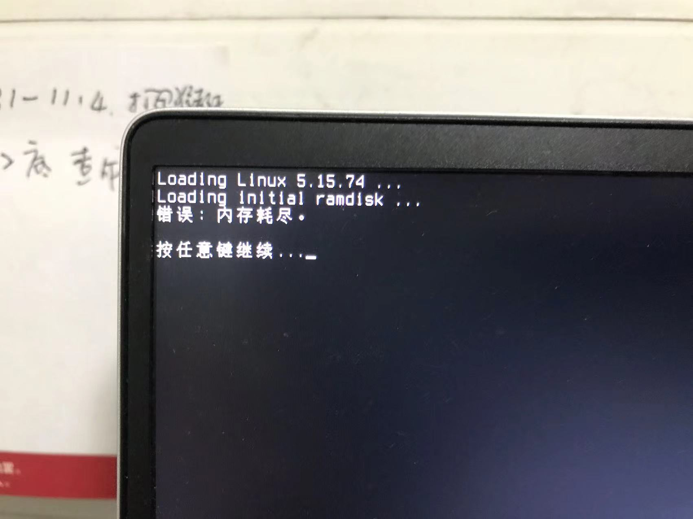
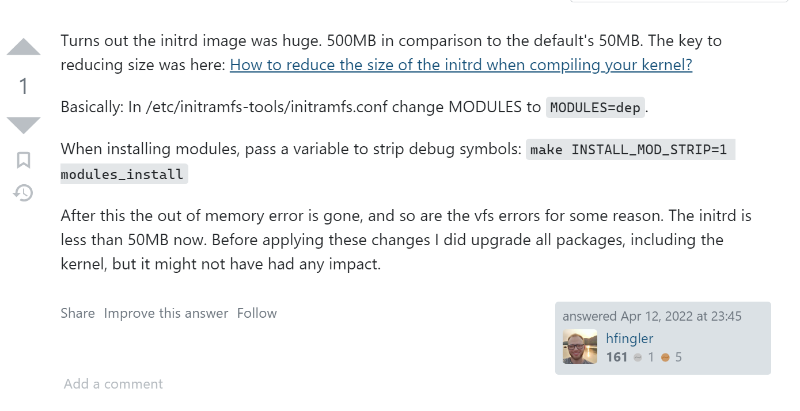
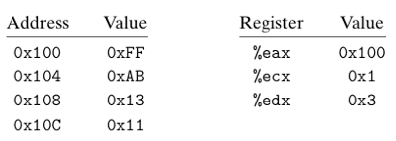

done!

## LKD_Chapter_3

计算thread_info的偏移

```asm
# current_thread_info() assuming 8KB stack size
movl $-8192, %eax
andl %esp, %eax
```

### movx

```  asm
movx source, destination
```

movx其中 x 可以是下面的字符：

* l用于32位的长字值

* w用于16位的字值

* b用于8位的字节值

  实例：

```asm
movl   %eax, %ebx #把32位的EAX寄存器值传送给32位的EBX寄存器值
movw   %ax, %bx   #把16位的EAX寄存器值传送给16位的EBX寄存器值
movb   %al, %lx   #把8位的EAX寄存器值传送给8位的EBX寄存器值
```


### andl

假定以下值存储在指示的存储器地址和寄存器中：



现在，我们有一条指令：

``` asm
addl  %ecx, (%eax)
```

EAX包含0x100; 0x100中的值为0xFF; ECX包含0x1。

0x1 + 0xFF = 0x100。 

然后将最终结果放入EAX指向的地址。 因此，(0X100) == 0x100

### 解析

ESP point to the bottom 

value of EAX == -8192

EAX == -8192 + value of ESP
