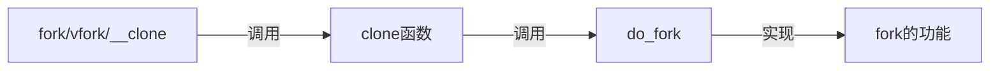

## 进程的概念

进程就是正在执行中的的程序和其所使用资源的总称。

## 进程的特性

 所有进程都是初始`init进程`的后代，进程之间是树的结构关系。

## 进程线程的关系

在Linux内核中进程线程都使用进程描述符~~即并不严格区分二者~~，只是将线程视为某进程的子进程。

## Linux如何存放和表示进程

内核通过名为进程描述符的结构表示进程，其结构类型是`task_struct`。通过进程描述符组成名为`task list任务队列`的双向循环链表。

每个`task_struct`在32位机器上大约占1.7KB内存。

```c
// linux/sched.h
struct task_struct{
    unsigned long state;
    int prio;
    unsigned long policy;
    struct task_struct *parent;
    struct list_head tasks;
    pid_t pid;
    // ...
}
```
### 分配task_struct结构
内核通过slab分配器动态分配`task_struct`，在每个内核栈的栈底创建一个`thread_info`结构体，其中的`task`存放指向实际指向`task_struct`的指针。

```c
// asm/thread_info.h
struct thread_info{
    struct task_struct *task;
    // ...
}
```

## 创建进程

* spawn == fork + exec族

### 写时拷贝

注意copy on write(写时拷贝)的优化思路：创建进程先使父子进程共享地址空间，只有到子进程需要写入时再拷贝。   

### fork()



### vfork的缺陷(答书P28页的设想)

如果exec()调用失败，会导致死锁。 

## 如何把新的执行映像装入地址空间*

exec()系统调用族

## 如何表示进程的层次关系*

想想树形结构

## 父进程如何收集后代的信息*

wait()系统调用

## 进程的消亡

调用exit()~~进程自己体面或帮进程体面~~

### 孤儿进程

父进程在该子进程之前终止，`init`进程会成为子进程新的父进程，`init`进程会清理掉僵尸进程。

## 拓展

### list_entry()函数 ——从获取目标进程到linux内核双链表的思想与实现

``` c
list_entry(task -> task.next, struct task_struct, tasks) //LKD_Chapter_3_page_26 对于给定进程，获取链表中的下一个进程
```


``` c
#define list_entry(ptr, type, member) \
	container_of(ptr, type, member)
 
#define container_of(ptr, type, member) ({			\
	const typeof( ((type *)0)->member ) *__mptr = (ptr); // (1) 
	(type *)( (char *)__mptr - offsetof(type,member) );}) // (2) 
        
#define offsetof(TYPE, MEMBER) ((size_t) &((TYPE *)0)->MEMBER)
```

用途： 利用结构体的已知__成员__（一般是__包含__在结构体中的指针）获得结构体对象的首地址，即获得结构体指针。


（1）定义一个常量指针__mptr，并将ptr赋值给它。合法性检查

（2）用当前节点地址ptr值剪掉member离type结构体首地址的距离，最后就得到了ptr节点指向的节点的type类型结构体的首地址。

示意图


#### 验证offset计算偏移量

``` c
#include <stdio.h>

/*
typedef struct listhead
{
    
    listhead * prev;
    listhead * next;
}listhead;
*/

typedef struct 
{
    long long num;
    char name;
    int num_1;
    //listhead tasks;
}node;

int main()
    {
        printf("offset:%u\n", \
        &((node *) 0) -> num_1);
    }
```


