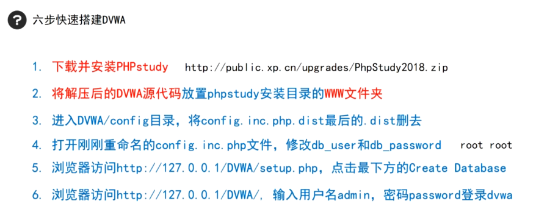
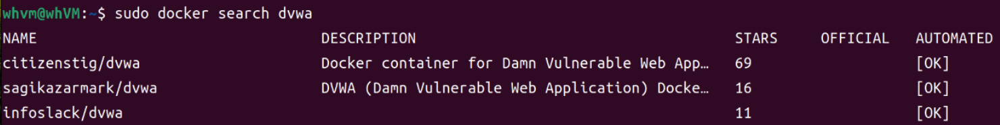
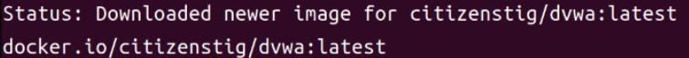
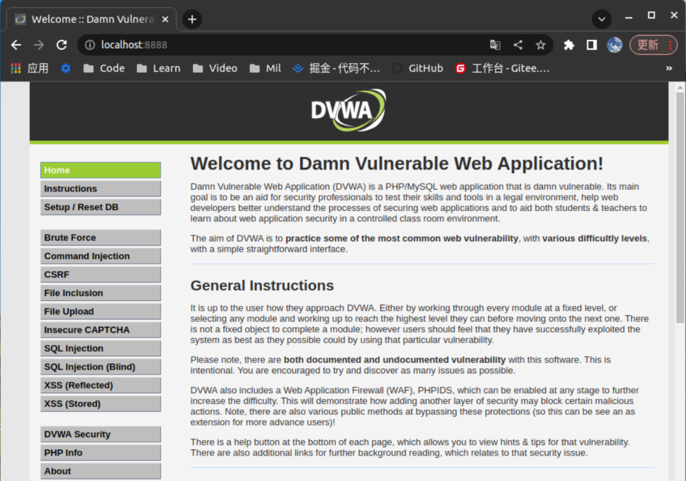
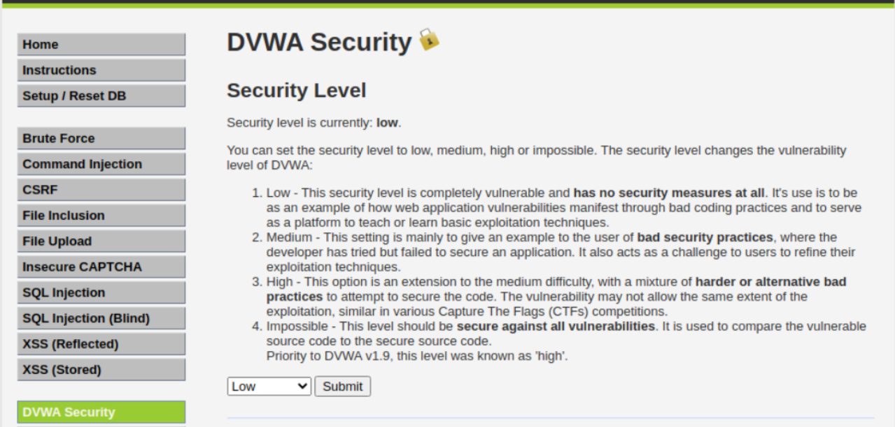

Web安全即网站安全

1. 寻找漏洞
2. 利用漏洞

漏洞

> 硬件、软件、协议的具体实现或系统安全策略上的缺陷，使得攻击者可以在未授权的情况下访问或破坏系统。


常见漏洞可查看`OWASP TOP 10`

可以说它是相关领域从业者的”圣经“


靶场

> 合法的可供练习攻击和修复技术的网站

`DVWA`靶场搭建


基于PHP Study技术的DVWA靶场搭建

* PHP环境

  * WAMP

    or

  * PHP Study

* DVMA源代码  -> 克隆下来

> https://github.com/difininja/DVMA/archive/master.zip




Linux环境下基于Docker的DVWA靶场搭建

```shell
# docker的安装
sudo apt-get install -y docker docker-compose

# docker启动、停止、重启
sudo systemctl start/stop/restart docker

# 配置docker加速器
sudo vim /etc/docker/daemon.json

{
"registry-mirrors":[
"https://dockerhub.azk8s.cn",
"https://reg-mirror.qiniu.com",
"https://1rqfztnd.mirror.aliyuncs.com"
	]
}

sudo systemctl daemon-reload
sudo systemctl restart docker

# DVWA的安装
sudo docker search dvwa
sudo docker pull *** 	#此处填写你指定的文件以拉取安装
sudo docker run --rm --name dvwa -it -p 8888:80 citizenstig/dvwa #docker运行dvwa
netstat -ntulp |grep 8888 # 查看容器指定的端口是否被打开
本地使用浏览器访问
localhost:8888

/* default account
 * 账号:admin
 * 密码:password
 */
```





Aha! ^o^👍



记得调整靶场安全等级

