# 部署LMP 

## Linux内核编译

安装依赖

```bash
sudo apt-get install git fakeroot build-essential ncurses-dev xz-utils libssl-dev bc flex libelf-dev bison binutils-dev libcap-dev libreadline-dev pahole -y
```

查看可用的源码版本

```bash
apt-cache search linux-source 
```

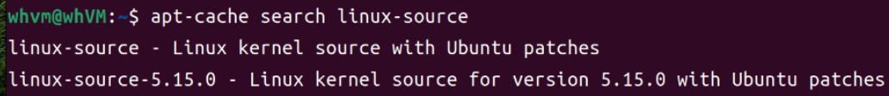

复制debian  

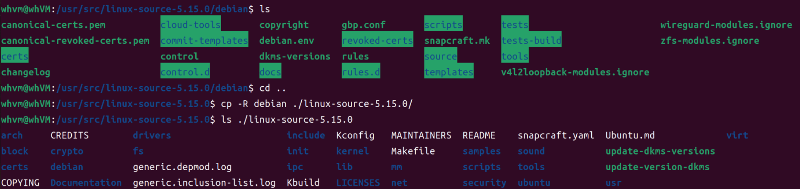


> # [Configuring the Linux Kernel][3]
>
> 1. Copy the /boot/config-5.8.0–50-generic (check the kernel version on your system) to top of the kernel tree and name it .config
> 2. Edit the .config: CONFIG_DEBUG_INFO_BTF=y
> 3. Edit the Makefile with the right VERSION (50) and EXTRAVERSION(=-btf or whatever name you want to identify this kernel)

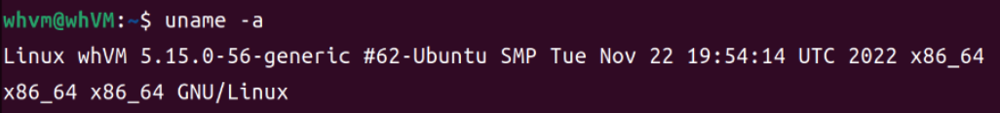

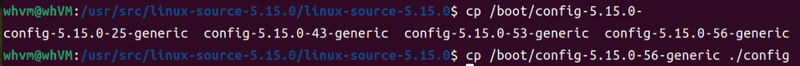

Oops, I have done that.Hope it's ok.


``` bash
make menuconfig
```

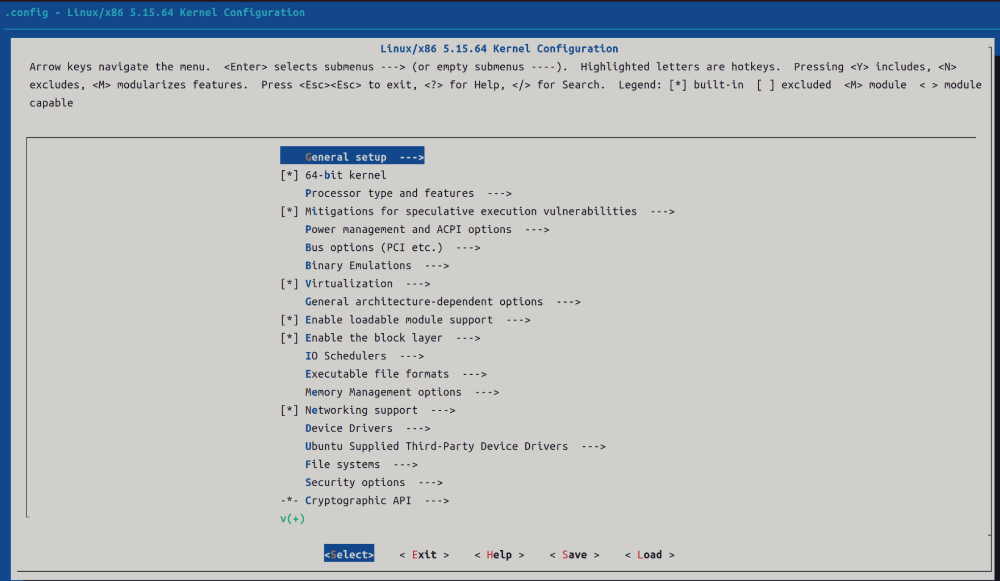

查找配置

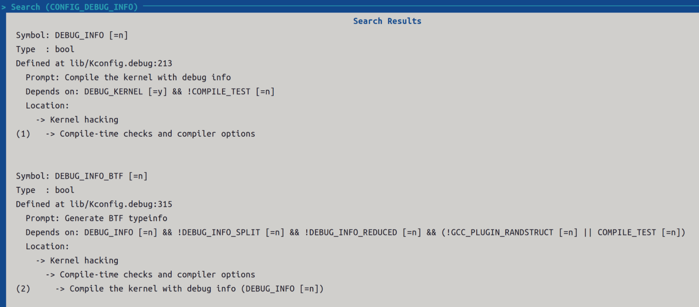

更改配置

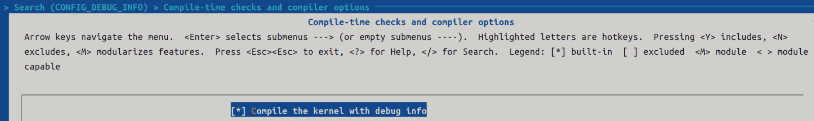

 Aha!

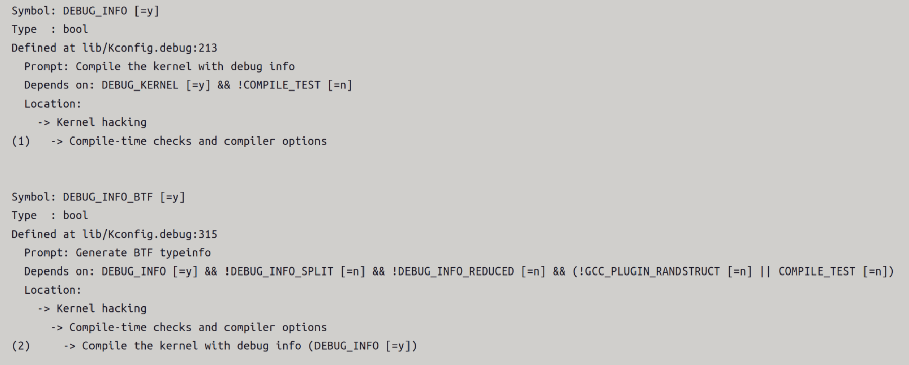


```bash
make #编译源码
```


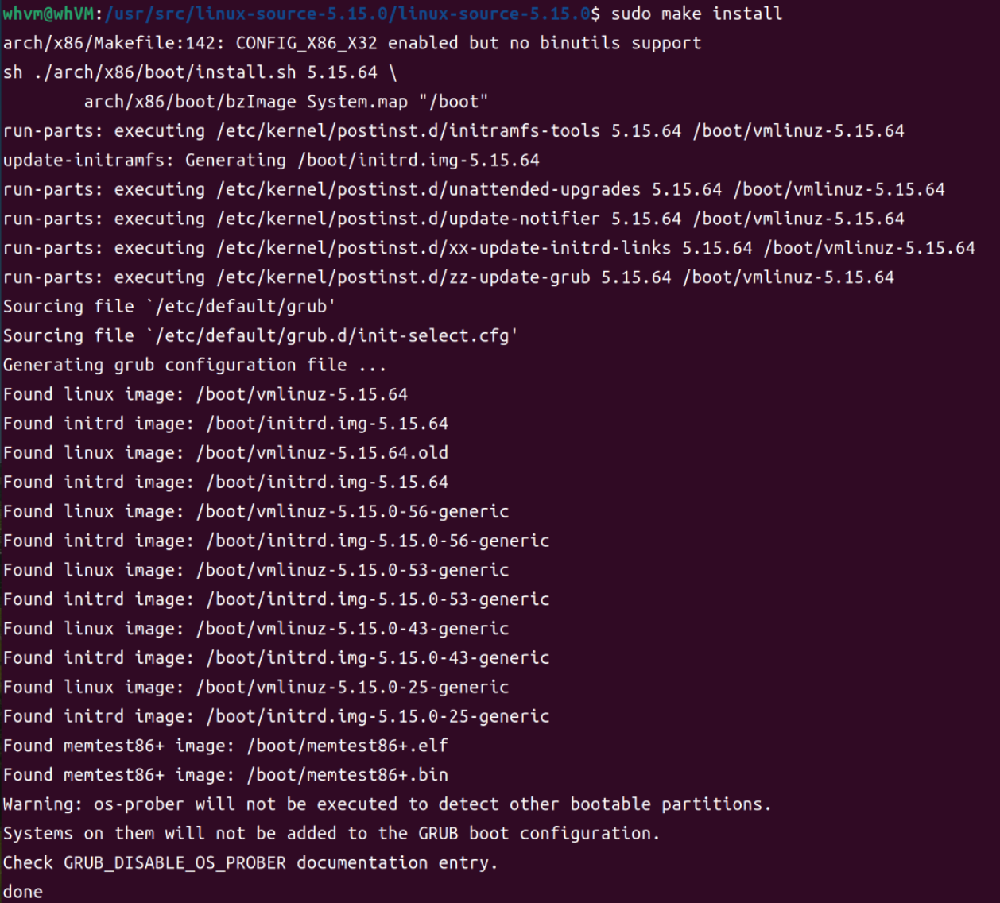


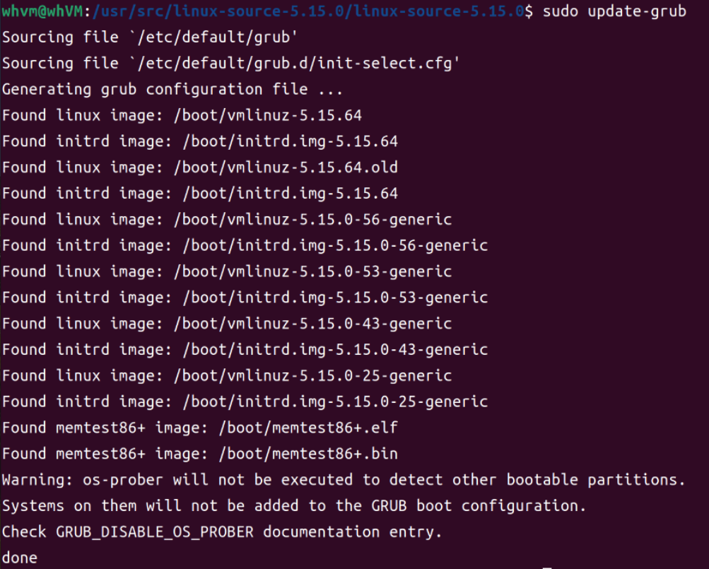


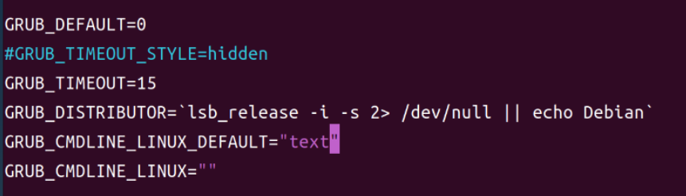


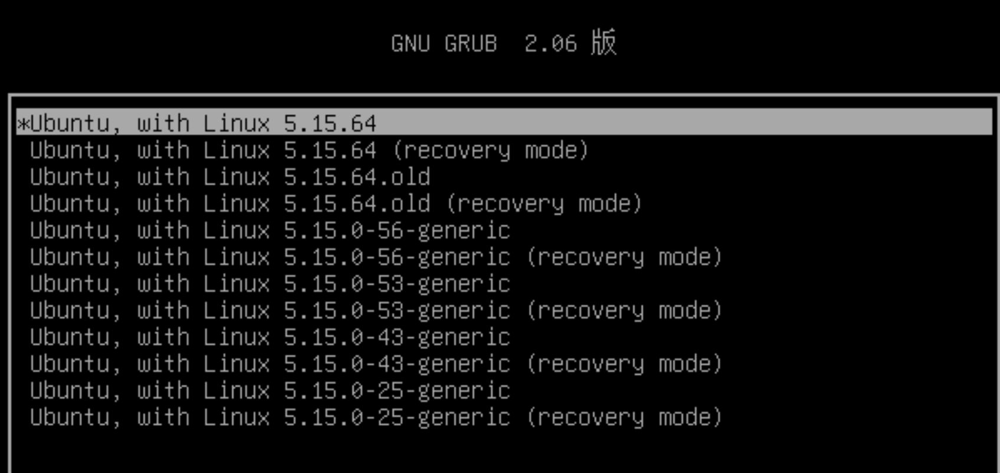

 Done

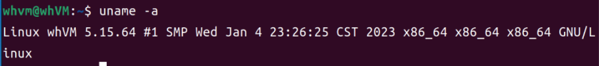


## LMP

克隆下来，进入目录

编译`linux-realtime-probe-tool`

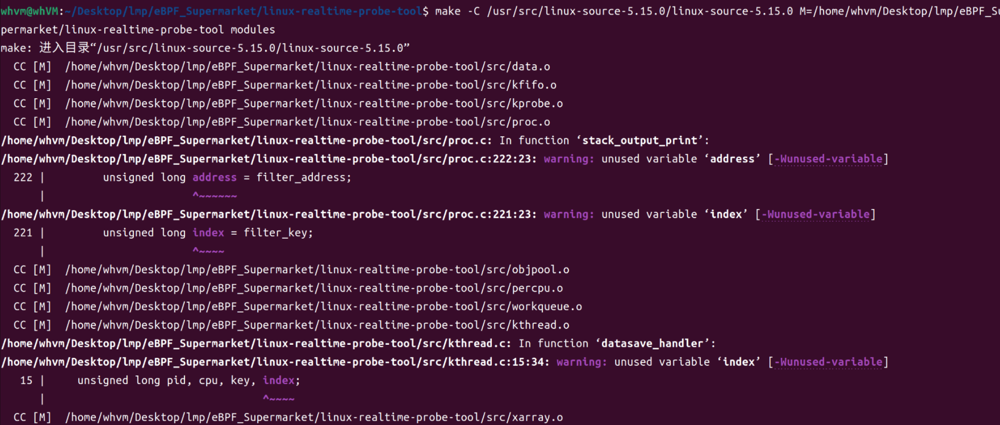


参考`eBPF_Documentation/content/start/installation/install_lmp`在lmp的安装部署出现错误

> cd lmp # 根据自己实际情况切换到lmp根目录
>
> sudo make db 
>
> make 


## 参考链接

[1]: https://linuxkerneltravel.github.io/lmp/
[2]: https://stackoverflow.com/questions/73210590/kernel-compilation-error-when-config-debug-info-btf-is-enabled
[3]: https://medium.com/@suruti94/building-the-linux-kernel-with-btf-1a617cfb4a24
[4]:http://kerneltravel.net/blog/2021/compile-kernel/


