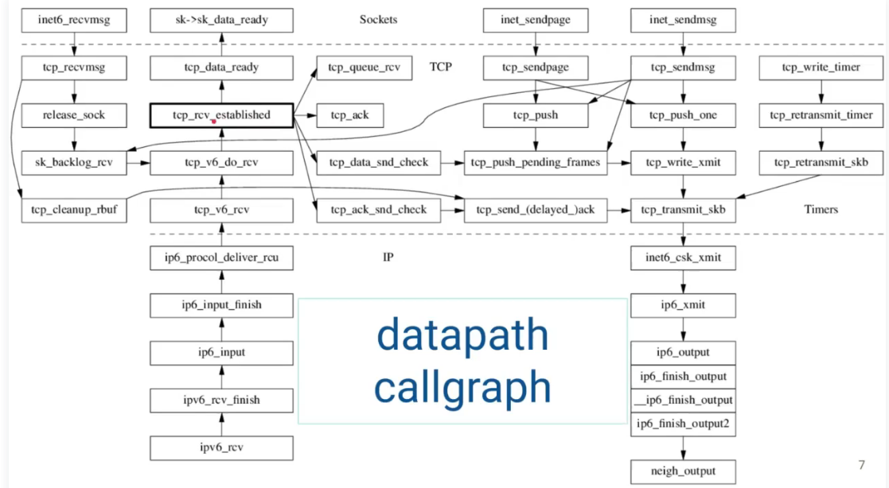
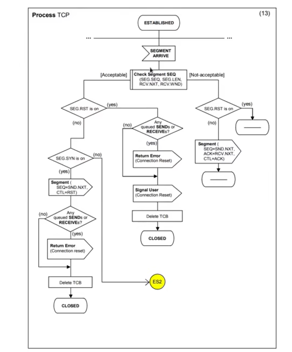
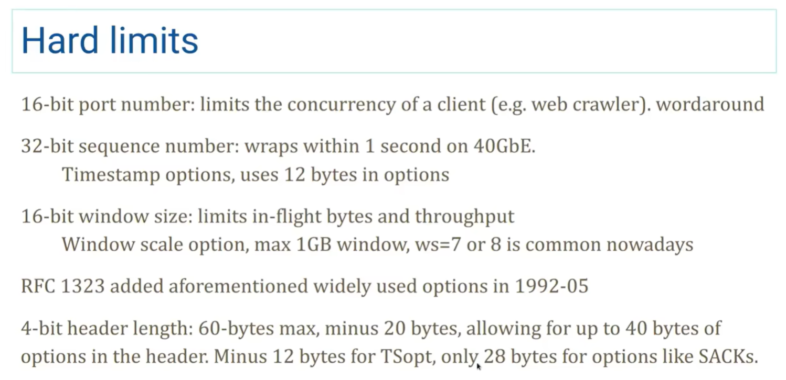

能够基本使用`bpfrace`抓取到内核协议栈的部分数据,但是不知道那些数据该如何分析，我认为还是对`ip/tcp`的理解不足，因此看了下`tcp/ip概述`

`tcp`字节流协议之所以可靠的原因

* 每个字节皆有编号

* 累计正应答(如果把完整数据流看作一本书，分节段落看作书的某一页，回答某页，表示已经收到某页之前的所有内容)

* 未应答重发(超时重传)

它是唯一能在广域网上使用的协议

`tcp`的绝大多数状态(内容)是在`ESTABLISHED`而非3wh和4-times close（三次握手四次挥手）建立连接

`linux`内核收发的流程图（其中`tcp_rcv_established`占大头）

`tcp`在`ESTABLISHED`链接建立的状态下`tcp`状态机的抽象

进入：用户调用（API）, segment sent, 定时器

输出：segment arrive

​								`tcp`在`ESTABLISHED`下的流程

`tcp` 2022_08 RFC 9293

2019 BBRv2 

拥塞控制算法业界开发活跃~~（当然死了的也很多）~~

***核心思想***：有重传的累计正向应答（本质）

滑动窗口，拥塞控制是可选的（可以不用）

缺点

没有提供足够的内存空间

解决办法：使用int64_t 更安全 除了毫秒

近期实例：SQLite 的int32漏洞2022_10

突破16bit的`tcp`端口限制

每个进程分`ip`？？？思路

启发

设计协议不要使用bit fields 比特域

例子：日期使用Julian Day

如果需要节省空间怎么办

思路：1. `varint`变长 （UTF-8） 2. 压缩