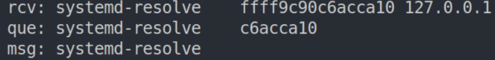

# 实践检验

## 代码部分

```c 
#! /usr/bin/env/bpftrace
#include <linux/socket.h>
#include <net/sock.h>
#include <linux/udp.h>
#include <linux/skbuff.h>
#include <linux/ip.h>


/*作废代码
kretprobe: skb_transport_header
{
    @pro = (struct udphdr *) retval;
    @en = @pro -> dest;
    printf("\npro:%x\n" , @en);
}
*/

kprobe: __udp4_lib_rcv
{
    $skb = (struct sk_buff *) arg0;
    /*  
     *  UDP 数据包校验和正确 arg2为int proto
     *  只看能保留下来的
     *  if (proto == IPPROTO_UDP) {
     *      if (ulen < sizeof(*uh) || pskb_trim_rcsum(skb, ulen))
     *          goto short_packet;
     *      uh = udp_hdr(skb);
     *      }
     */
    if(arg2 == IPPROTO_UDP){
        $iph = (struct iphdr *)($skb->head + $skb->network_header);
        @dir = ntop(AF_INET, $iph->daddr);
        $pro = (struct udphdr *)($skb->head + $skb->network_header);
    }
    printf("rcv: %-18s %lx %s \n", comm, $pro, @dir);
}

/*
 *  单播的udp数据包， 广播和组发送的没看完。。。。。
 *  __udp4_lib_lookup_skb结构查询
 */
kprobe: udp_queue_rcv_skb
/ comm == "systemd-resolve" /
{
    $sk = (struct sock *) arg0;
    $skb = (struct sk_buff *) arg1;
    $pro = (struct udphdr *)($skb->head + $skb->network_header);
    @up = (struct udp_sock *)$sk;
    printf("que: %-18s %x\n", comm, $pro);
}
//接收处理过程完成
kprobe: udp_recvmsg
/ comm == "systemd-resolve" / 
{
    $sk = ((struct sock *) arg1);
    printf("msg: %-18s\n", comm);
}

/*作废代码
kprobe: sk_buff_data_t transport_header,
kprobe: tcp_v4_rcv
{
    
    //ret = tcp_v4_do_rcv(sk, skb); // 处理有效TCP段
    printf("%-6d %-18s 0x%-x\n", pid, comm, @thr)
}
/*
*                time("%H:%M:%S   ");
*                printf("%-19u %-15s %d,%s,%s,%-20d ", $nsid, $netif, pid, comm, func, cpu);
*                printf("flags:%s, seq:%-u, ack:%u, win:%-25u ", $pkgflag, $seq, $ack, $win);
*                printf("%s:%-15d  %s:%-15d %d ms\n", $srcip, $sport, $dstip, $dport, (nsecs / 1000000) % 1000);
*/
```

## 验证结果



# 总结

* 如果需要看到内联函数的某个操作或定义在结构的操作，需要自己根据定义在跟踪时编程复现
* 找函数的参数需要巧用tracepoint
* 理解检验函数的调用，要提高阅读代码的能力和速度~~（就是基础知识理解不够）~~
