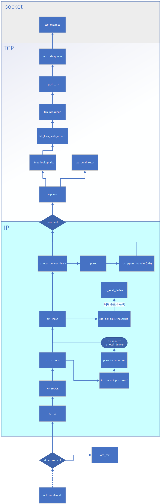

粗略了解了接收包，IP，TCP途径的一些函数关系

## 遗留的问题/不懂的

1. `netif_rx`数据从帧到包的过程，踩到钢板了

2. IP网络层的分片,没有写

3. IP网络层调用路由子系统的过程

4. TCP的`tcp_rcv`函数内部各流程之间的调用关系

5. 传输层UDP还没看。。。。。

6. 一些书对ICMP的分层有冲突

---

`tcp_v4_rcv`和`tcp_rcv_v4`不同书的表达不同，我统一用`tcp_rcv`表示了，困惑的是`v4`指的是什么？

是对应`IPV4`或`IPV6`吗？