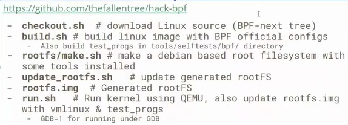
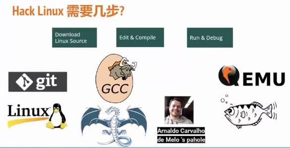
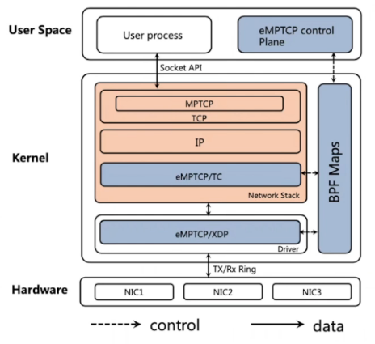
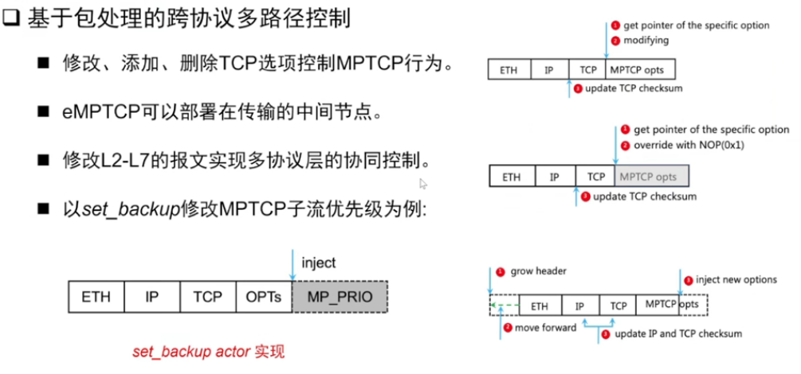
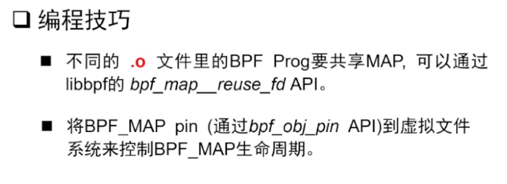
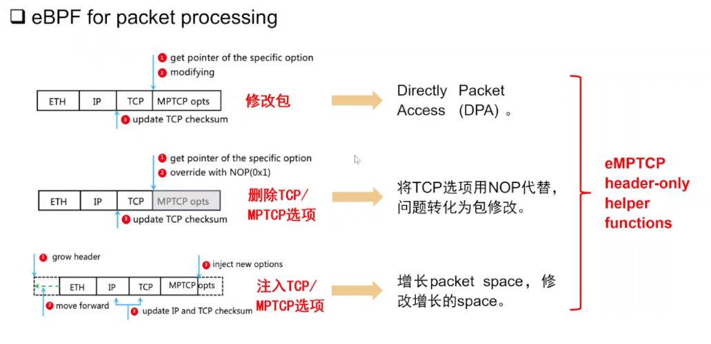
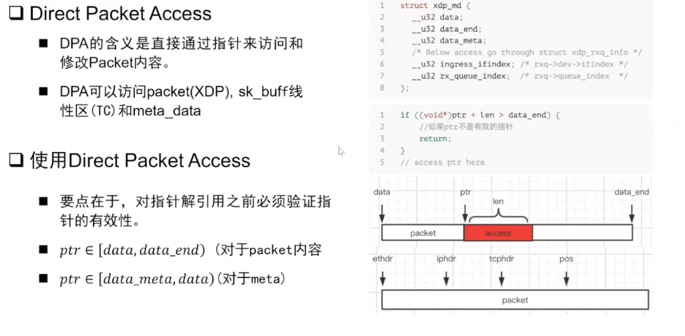
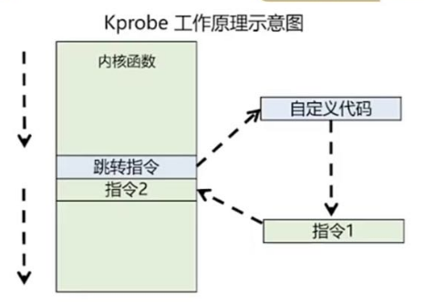
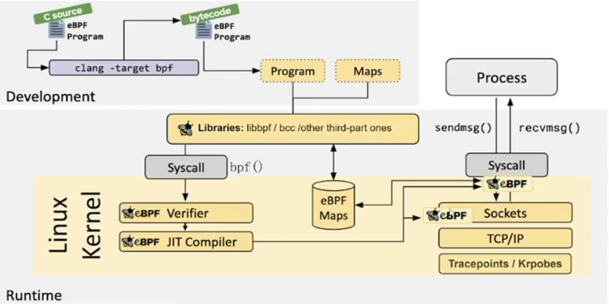

# 如何修改Linux内核？

之前王老师在指导思路时，提到将Linux平台作为实践平台，修改Linux内核并编译运行，再结合eBPF编写工具观察内核运作的变化。

这周恰好碰到孙老师的how to hack Linux kernel的直播~~，不得不说缘妙不可言~~

那么需要几步呢？

1. Download Linux Source -> git clone

   ​	

   

2. Edit、Compile -> Use GDB

3. Run and Debug -> Use QEMU虚拟器

实践还不没来得及

# eBPF大会

## eMPTCP(沈典dshen@seu.edu.cn)

网络的趋势是多路径传输？

Multipath TCP

与TCP对用户层接口一致，应用层无需更改，分流由内核协议栈完成

MPTCP的设计不适合拓展

与传统协议栈一样基于终端，缺乏底层网络的链路感知和控制能力

eBPF较难保证易用性和安全性~~大家都不喜欢看报错~~ -> 或许未来eBPF平台化和易用化可以解决, 这个想

选择器-执行器

尾调用？？？

policy context机制？

## 感受

简单了解了eBPF注入内核Kpobe的工作流程

就是先在挂载函数上的指令替换为跳转指令（指针？），先跳转执行eBPF注入的代码指令，再跳转回执行原指令。

eBPF程序要注入内核，需要通过检验器校验安全

无法通过检验，是大多数使用者认为其易用性不佳的原因

之前桂民强同学的docker思路和郑同学的工作，让eBPF环境更好部署、并让工具易用

提供直接打包能通过的工具和工具集市或许是发展的趋势

这次的大会还提到了未来应用AI技术判断运行特征，

我的想法: 利用数据处理中的系统聚类等方法是否是比AI更容易可行；

又想了一下可能不行，机器学习训练完的算法程序可以直接部署，系统聚类的方法只是能根据特征分类，无法判断。